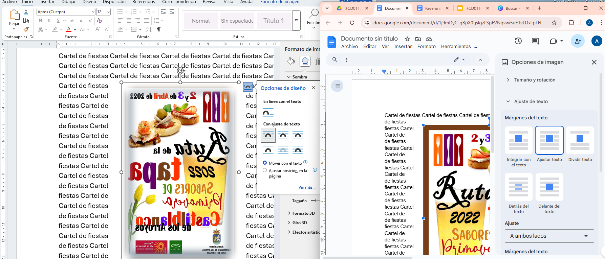

# 🧭 **GUÍA 7 – INSERTAR IMÁGENES Y DAR FORMATO**

## 🎯 **Objetivo de la guía**

Aprender a **insertar, colocar y dar formato a imágenes** dentro de un documento de texto, controlando su posición, ajuste con el texto y bordes decorativos para crear documentos visualmente atractivos.

---

## 🧩 **1. ¿Por qué usar imágenes en un documento?**

Las imágenes ayudan a:

* **Atraer la atención** del lector.
* **Ilustrar contenidos** (gráficos, diagramas, fotos).
* **Mejorar la presentación** de informes, carteles o memorias.

💡 Una buena imagen debe tener relación con el texto, estar bien alineada y tener un tamaño adecuado.

---

## ⚙️ **2. Cómo insertar y dar formato a imágenes**

---

### 🟦 **MICROSOFT WORD**

1. **Insertar imagen**

   * Menú **Insertar → Imágenes**.
   * Elegir: “Este dispositivo”, “Imágenes en línea” o “Iconos”.
2. **Dar formato**

   * Selecciona la imagen → pestaña **“Formato de imagen”**.
   * Ajusta **tamaño, color, brillo y bordes**.
3. **Posición y ajuste del texto**

   * Opción **“Ajustar texto”** → elige:

     * *En línea con el texto*
     * *Cuadrado* (texto rodea la imagen)
     * *Estrecho*
     * *Detrás del texto* o *Delante del texto*
4. **Añadir borde**

   * En “Formato de imagen” → “Borde de imagen” → selecciona color y grosor.

💡 *Consejo:* Usa “Cuadrado” o “Estrecho” para insertar imágenes entre párrafos.

---

### 🟩 **LIBREOFFICE WRITER**

1. **Insertar imagen**

   * Menú **Insertar → Imagen → Desde archivo…**
2. **Mover y redimensionar**

   * Arrastra desde las esquinas para mantener proporciones.
3. **Ajuste con el texto**

   * Clic derecho sobre la imagen → **Propiedades → Ajuste**.
   * Opciones: “Paralelo”, “Dinámico”, “Detrás” o “Delante del texto”.
4. **Bordes y fondo**

   * Clic derecho → **Propiedades → Bordes** → elige estilo, color y grosor.

💡 *Truco:* Usa “Anclado como carácter” para mantener la imagen fija junto al texto.

---

### 🟨 **GOOGLE DOCS**

1. **Insertar imagen**

   * Menú **Insertar → Imagen → Subir desde ordenador / Drive / URL / Cámara.**
2. **Mover y ajustar**

   * Selecciona la imagen y elige entre:

     * *En línea*
     * *Ajustar texto*
     * *Rodear texto*
     * *Detrás del texto*
3. **Tamaño y posición**

   * Usa las esquinas para redimensionar.
   * Clic derecho → “Opciones de imagen” → “Ajuste” o “Tamaño y rotación”.
4. **Borde**

   * Menú rápido (barra inferior de imagen) → “Color del borde” → elige color y grosor.

💡 *Sugerencia:* Si se mueve el texto, cambia el ajuste a “Ajustar texto” para mantener la posición.

---

## 🧠 **3. Consejos prácticos**

✅ Inserta imágenes con buena resolución, pero sin que aumenten mucho el tamaño del archivo.
✅ Mantén coherencia visual (bordes, tamaños similares).
✅ Usa alineación centrada o cuadrada para documentos formales.
✅ No satures la página con demasiadas imágenes.
✅ En informes, añade pies de imagen con numeración (por ejemplo, “Figura 1. Logotipo del centro”).

---

## 🧩 **4. Ejercicio rápido**

Crea un documento con:

* Título centrado.
* Un párrafo de texto introductorio.
* Inserta **una imagen** alineada con el texto en modo “Cuadrado” o “Rodear texto”.
* Añade **borde y sombra** a la imagen.
* Guarda el archivo con el nombre: *Ejercicio_imagenes_tunombre.docx*

--

## 🧱 **5. Ejercicio aplicado: Cartel informativo**

Diseña un **cartel informativo** sobre un tema libre (evento, curso, actividad).
Debe incluir:

* **Título principal** en estilo grande.
* **Dos o más imágenes** con distintos ajustes de texto.
* **Bordes decorativos** en las imágenes.
* **Uso de colores o fondos** para resaltar secciones.
* **Tu nombre y fecha** en la parte inferior.

💡 *Opcional:* Exporta el cartel a **PDF** para su impresión o publicación.

