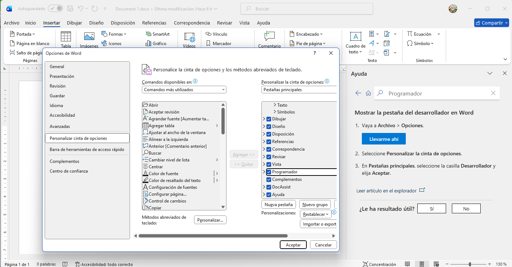
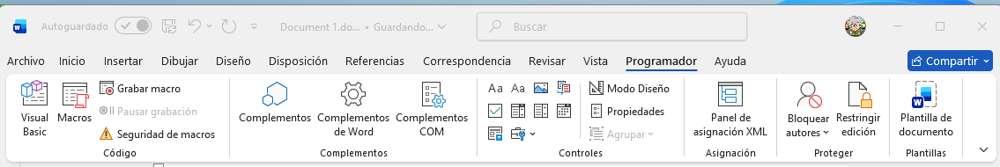
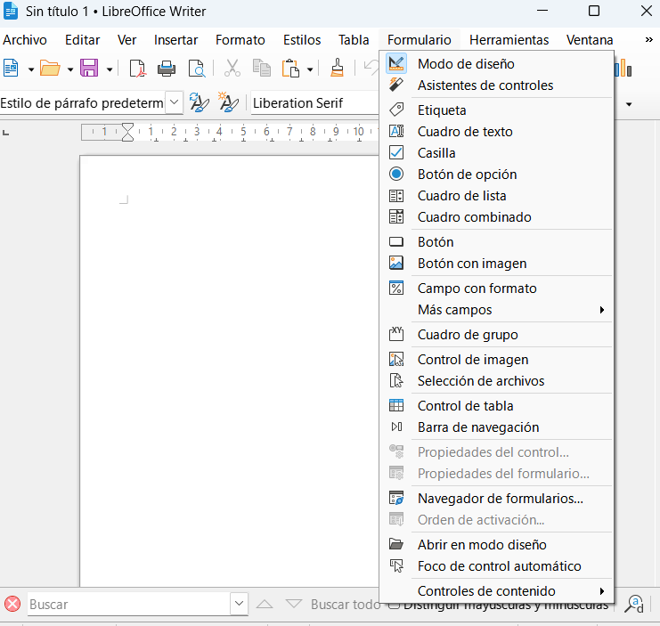

## 🧭 Manual: “Formularios en Procesadores de Texto e Integración con Herramientas Web”

### 🎯 Objetivo

Que los alumnos comprendan cómo **crear y gestionar formularios** dentro de los procesadores de texto (Word, Writer, Docs) y cómo **ampliar su funcionalidad** mediante herramientas web externas (Google Forms, Microsoft Forms, Jotform) para recoger datos, automatizar flujos y generar documentos derivados.

---

### 1. Introducción a los formularios en procesadores de texto

* ¿Qué se entiende por formulario en un procesador de texto? (campos rellenables, casillas, desplegables)
* ¿Cuándo conviene usar un formulario interno vs. uno web?
* Ventajas: reutilización, uniformidad, automatización.
* Breve presentación de las tres herramientas externas principales: Google Forms, Microsoft Forms, Jotform.

---

### 2. Crear formularios directamente en los procesadores

**2.1 Microsoft Word**

* Activa la pestaña *Desarrollador*. ([Adobe][1])

* Insertar campos de contenido: cuadro de texto, casillas de verificación, desplegables. ([Jotform][2])

* Proteger el formulario para que sólo se rellenen los campos.
* Guardar y distribuir (como .docx, .pdf).
* Ventajas / limitaciones: buena para distribución cerrada, menos potente para recopilar respuestas en línea.

**  recomedación ** 
Usar plantillas y modificarlas. Nos vamos a simplificar mucho la vida.

**2.2 LibreOffice Writer**

* Insertar controles de formulario: Barra “Control de formulario”.
* Definir propiedades de controles, proteger el documento.
* Exportar como PDF interactivo.
* Uso ideal para ambientes de oficina donde no se requiere entrada online.

**2.3 Google Docs**

* Aunque no está tan orientado a formularios interactivos completos, se puede:

  * Usar tablas con celdas vacías como “campos”. ([sizle.io][3])
  * Insertar casillas de verificación manualmente.
* Ideal para versiones imprimibles o colaborativas simples.

---

### 3. Integración con herramientas web externas

**3.1 Google Forms**

* Crear formularios en línea.
* Integración con Google Sheets, exportación de respuestas.
* Automatizaciones: por ejemplo, activar una plantilla de Word cuando se responde al formulario. Ejemplo: la herramienta “Google Forms → Word Templates” mediante plataformas de automatización. ([Make][4])
* Uso en clase: formulario de inscripción, encuesta, test.

**3.2 Microsoft Forms**

* Crear encuestas o quizzes dentro del ecosistema Microsoft 365.
* Función de importar un documento Word o PDF para convertirlo en formulario. ([Soporte de Microsoft][5])
* Automatización: respuestas que generan documentos Word/PDF usando Power Automate. ([plumsail.com][6])
* Ideal para entornos Windows/Office 365.

**3.3 Jotform**

* Plataforma web de formularios rica en integraciones.
* Integración con múltiples servicios (SMS, bases de datos, OCR) ([knack.com][7])
* Permite exportar respuestas, generar documentos, integrarse con procesadores vía API o servicios “no-code”.
* Uso: formularios complejos, recogida de datos, flujos administrativos.

---

### 4. Posibilidades de flujo: del formulario al documento

* Diseño del formulario → recogida de datos → generación automática de documento en Word/Docs con los datos. Ejemplo: mediante servicios como Portant Workflow, Zapier. ([portant.co][8])
* Crear plantilla en Word/Writer/Docs con campos marcados (placeholders).
* Conectar la tool de formularios para que genere múltiples documentos personalizados.
* Distribución: por correo, PDF, impresión.

---

### 5. Comparativa de escenarios y recomendaciones

| Escenario                                                | Mejor herramienta              | Motivo                                                              |
| -------------------------------------------------------- | ------------------------------ | ------------------------------------------------------------------- |
| Formulario simple de inscripción                         | Google Forms + Google Docs     | Fácil, gratuito, colaborativo                                       |
| Formulario para entorno corporativo Office               | Microsoft Forms + Word         | Integrado en 365, posibilidad de generar documentos automáticamente |
| Formulario complejo con flujos y múltiples integraciones | Jotform                        | Gran flexibilidad, muchas integraciones                             |
| Formulario básico para imprimir                          | Word/Writer formulario interno | No necesidad de recopilar online respuestas                         |

---

### 6. Buenas prácticas

* Define claramente los campos necesarios antes de diseñar el formulario.
* Usa plantillas de documento para coherencia visual.
* Protege los formularios internos para que sólo se rellenen los campos previstos.
* Verifica la compatibilidad móvil/web si el formulario se va a rellenar online.
* Automatiza siempre que sea posible para evitar trabajo manual repetitivo.
* Guarda versiones de plantilla e historial de datos.

---

### 7. Ejercicio práctico sugerido

**Enunciado:** Diseña un sistema completo para tu curso o para una actividad:

1. En la herramienta web de formularios de tu elección (Google Forms, Microsoft Forms o Jotform) crea un formulario de registro/inscripción para el curso.
2. Diseña una plantilla en Word o Writer (o Google Docs) que servirá como **certificado de participación**, con campos que se rellenarán automáticamente.
3. Configura la automatización que, tras cada envío del formulario, genere un documento personalizado (PDF) con los datos recogidos: nombre del alumno, fecha, tema del curso.
4. Comparte el formulario con los alumnos, simula varias inscripciones y verifica que se generan los documentos correctamente.
5. Expón en tu manual los pasos que seguviste, captura pantallas, explica los puntos de integración y evalúa la herramienta empleada.

---

¿Te gustaría que redacte este manual completo como **documento base (.docx o .odt)**, listo para entregar a los alumnos, con estructura, cabeceras, espacio para anotaciones y referencias a las herramientas? Puedo generarlo y enviártelo para que adaptes según tu curso.

[1]: https://www.adobe.com/acrobat/hub/make-a-fillable-form-in-word.html?utm_source=chatgpt.com "How to create a fillable form in Microsoft Word | Adobe Acrobat"
[2]: https://www.jotform.com/blog/how-to-create-a-fillable-form-in-word/?utm_source=chatgpt.com "How to create a fillable form in Microsoft Word"
[3]: https://sizle.io/how-to-create-a-fillable-form-in-word-google-docs/?utm_source=chatgpt.com "How To Create A Fillable Form In Word & Google Docs - Sizle"
[4]: https://www.make.com/en/integrations/docx-templater/google-forms?utm_source=chatgpt.com "Microsoft Word Templates and Google Forms Integration - Make"
[5]: https://support.microsoft.com/en-us/office/convert-a-word-or-pdf-form-or-quiz-to-microsoft-forms-66b7e9bc-eb0d-4c65-b7e6-f9f92dcd71cb?utm_source=chatgpt.com "Convert a Word or PDF form or quiz to Microsoft Forms"
[6]: https://plumsail.com/docs/documents/v1.x/user-guide/processes/examples/create-word-and-pdf-documents-from-microsoft-forms.html?utm_source=chatgpt.com "Convert Microsoft Forms Responses to Word or PDF - Plumsail"
[7]: https://www.knack.com/blog/jotform-integrations-guide/?utm_source=chatgpt.com "Jotform Integrations Guide (2025) - Knack"
[8]: https://www.portant.co/google-forms-to-docs?utm_source=chatgpt.com "Google Forms to Docs - Easy, Online & Free - Portant"
