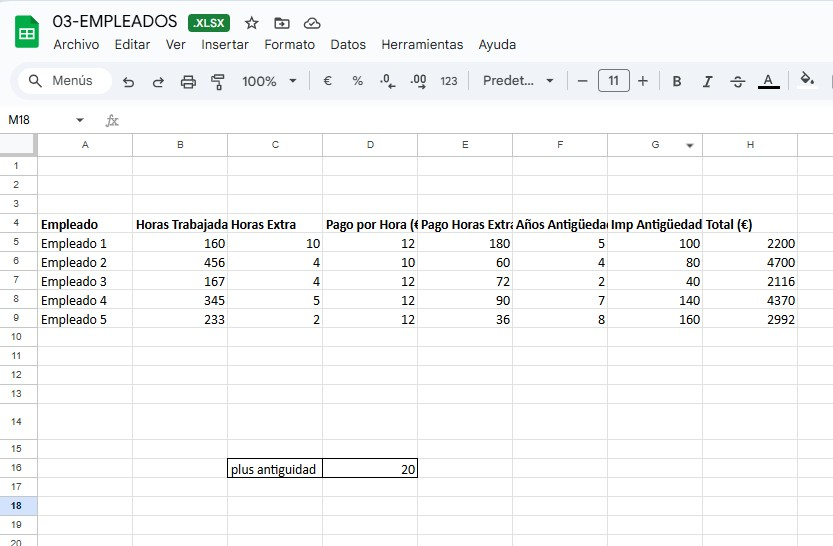

📘 Contenido del archivo

La hoja incluye:

Empleado

Horas trabajadas

Horas extra

Pago por hora

Cálculo automático de pago por horas extra
(con factor x1,5)

Años de antigüedad

Plus por antigüedad (4€ por año)

Total (suma de todo)

## mejora 

Años antigüedad calculada a partir de valor "absoluto" (F4)

[ejemplo](https://docs.google.com/spreadsheets/d/1UC17exWjkVPfE5UCCtHMLY_QnnQlvjtj/edit?usp=sharing&ouid=112004176233581636878&rtpof=true&sd=true)