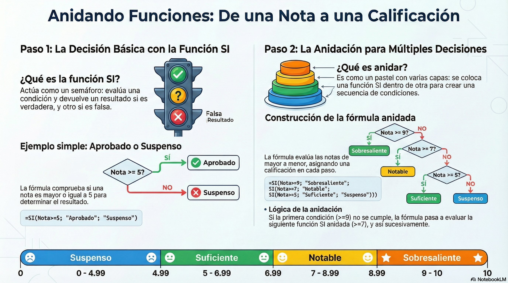
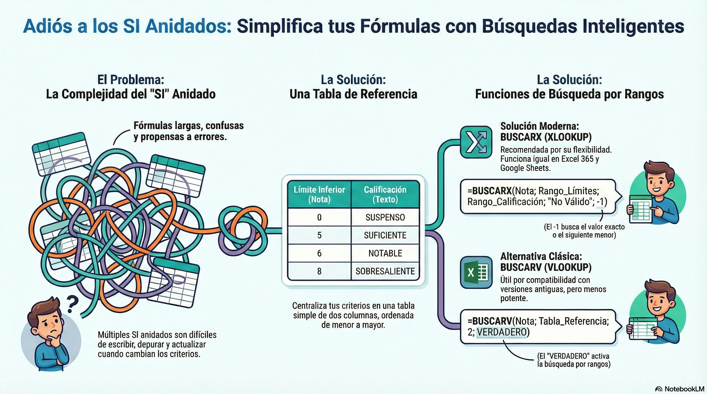

---

# 🧠 MÓDULO 5: Funciones Intermedias – El “Alcance” de Cada Plataforma

**Duración estimada:** 10 horas

> **Objetivo del módulo:**
> Explorar funciones intermedias que permiten tomar decisiones, buscar datos y trabajar con análisis más avanzados. Este módulo muestra claramente las **similitudes** entre Excel y Google Sheets, y sobre todo sus **diferencias de alcance**, donde cada uno destaca en un ámbito distinto.

---


# 5.1 Concepto Común: Funciones Lógicas y de Búsqueda

Estas funciones funcionan *idénticas* en Excel y Google Sheets.

---

## ✔️ 5.1.1 Función `SI` (IF) – Lógica básica

### Sintaxis

```
=SI(condición; valor_si_verdadero; valor_si_falso)
```

### Ejemplo

```
=SI(B2>=5; "Aprobado"; "Suspenso")
```

### Caso práctico

En una tabla de notas, crear una columna que indique el estado del alumno.

---

## ✔️ 5.1.2 Función `BUSCARV` (VLOOKUP) – Versión clásica

> Se incluye por compatibilidad con el mundo profesional.

### Sintaxis

```
=BUSCARV(valor; rango; columna; coincidencia_exacta_o_aproximada)
```

### Ejemplo

Buscar el precio de un producto según su código:

```
=BUSCARV(A2; Productos!A2:C100; 3; FALSO)
```

---

## ✔️ 5.1.3 Función `BUSCARX` (XLOOKUP) – Versión moderna (RECOMENDADA)

> Ya existe tanto en Excel 365 como en Google Sheets, con la **misma** sintaxis.

### Sintaxis

```
=BUSCARX( valor_buscado; rango_busqueda; rango_devolución )
```

### Ejemplo

```
=BUSCARX(A2; Productos!A:A; Productos!C:C)
```

✔ Más flexible
✔ Permite búsquedas bidireccionales
✔ No depende de la columna “hacia la derecha”

---

# 5.2 Enfoque Dual: Funciones Exclusivas – El Verdadero “Alcance”

Este es el punto clave del módulo: **cada plataforma tiene funciones exclusivas que muestran para qué mundo está diseñada.**

---

# 💙 5.3 Área Excel: Potencia de Procesamiento Local

## 🔵 5.3.1 Mención especial: **Power Query** (no se desarrolla en un curso de 50h, solo se introduce)

Power Query permite:

* Importar datos de archivos CSV, XML, JSON.
* Limpiar, transformar y combinar tablas.
* Automatizar procesos de carga.

> Excel es ideal para análisis pesado y modelado de datos en entornos corporativos.

---

## 🔵 5.3.2 Funciones útiles de Excel

Aunque no todas se profundizan, conviene mencionarlas:

* `SUMAR.SI`
* `SUMAR.SI.CONJUNTO`
* `CONTAR.SI`
* `CONTAR.SI.CONJUNTO`
* `INDICE` + `COINCIDIR`

> Excel destaca en **gran volumen de datos**, modelos financieros y automatización.

---

# 💚 5.4 Área Google Sheets: Su “Alcance Conectado a la Web”

Google Sheets brilla cuando se trata de **datos online**, automatización ligera y trabajo colaborativo.

## 🟢 5.4.1 Función estrella: `QUERY`

### ¿Por qué es tan potente?

Porque permite usar **SQL** directamente dentro de una hoja de cálculo.

### Ejemplo

Tabla con columnas A (Mes), B (Vendedor), C (Ventas):

```
=QUERY(A1:C100; "SELECT B, SUM(C) GROUP BY B ORDER BY SUM(C) DESC")
```

Obtienes:

* Ventas totales por vendedor
* Ordenadas de mayor a menor
* Sin fórmulas adicionales

🎯 **Query es la función más poderosa de Sheets.**

---

## 🟢 5.4.2 `FILTER` – Filtrar con fórmula (más fácil que en Excel clásico)

Ejemplo:

```
=FILTER(A2:C100; C2:C100>1000)
```

Filtra todas las filas donde las ventas > 1000.

---

## 🟢 5.4.3 `GOOGLEFINANCE` – Datos bursátiles en tiempo real

Ejemplo:
Precio actual:

```
=GOOGLEFINANCE("GOOG"; "price")
```

Histórico:

```
=GOOGLEFINANCE("AAPL"; "close"; HOY()-30; HOY())
```

---

## 🟢 5.4.4 `IMPORTHTML` – Importar tablas y listas desde una web

Ejemplo:

```
=IMPORTHTML("https://es.wikipedia.org/wiki/Econom%C3%ADa_de_Espa%C3%B1a"; "table"; 1)
```

---

## 🟢 5.4.5 `IMPORTXML` – Scraping avanzado

Permite extraer datos específicos con XPath.

Ejemplo:

```
=IMPORTXML("https://news.ycombinator.com"; "//a/@href")
```

---

## 🟢 5.4.6 `GOOGLETRANSLATE` – Traducción automática

```
=GOOGLETRANSLATE(A2; "es"; "en")
```

---

# 5.5 Ejercicios del Módulo

### ✔️ Ejercicio 1 – Lógica `SI`

Crear una columna “Estado” basada en la nota del alumno usando la función `SI`.

### ✔️ Ejercicio 2 – `BUSCARX`

En un listado de productos, traer el precio desde otra hoja.

### ✔️ Ejercicio 3 – Análisis con Query (Sheets)

Dado un listado de ventas:

* Mostrar total vendido por vendedor
* Ordenarlo de mayor a menor
* Filtrar solo un producto

### ✔️ Ejercicio 4 – `FILTER` (Sheets)

Filtrar todos los registros donde el importe > 500.

### ✔️ Ejercicio 5 – Importación desde web (Sheets)

Usar `IMPORTHTML` para traer una tabla de Wikipedia.

### ✔️ Ejercicio 6 – Excel SUMAR.SI.CONJUNTO

Sumar todas las ventas del vendedor “María” en el mes de enero.

---

# 5.6 Conclusión del Módulo

| Tema                           | Excel                                 | Sheets                        |
| ------------------------------ | ------------------------------------- | ----------------------------- |
| Función SI / BUSCARV / BUSCARX | Idénticas                             | Idénticas                     |
| Potencia                       | Procesamiento local + Power Query     | Conexión web + automatización |
| Funciones exclusivas           | Modelos financieros, transformaciones | Query, Import*, GoogleFinance |

> 🎯 **Idea clave del módulo:**
> Excel es una herramienta de análisis pesado en local; Google Sheets es una herramienta conectada, colaborativa y flexible. Dominar ambos mundos amplía tu “alcance profesional”.

---

## MULTIPLES CONDICIONES 

Para realizar multiples comparaciones, podemos usar los SI anidados



Esta solución no es escalable facilmente, ya que si añadimos un nuevo intervalo o cambiamos los valores debemos modificar las formulas. Podemos usar la tecnica de usar un rango de valores que nos establezcan los limites y usar las funciones de busqueda BUSCAR



## ANEXO

[Busqueda de datos](../recursos/Datos_Validación_BUSCARV.pdf)
