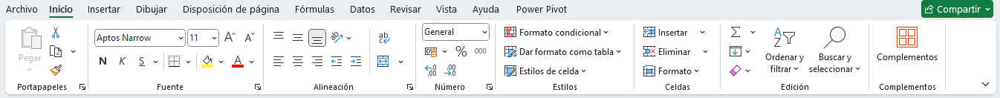
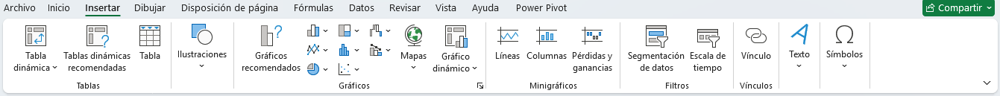
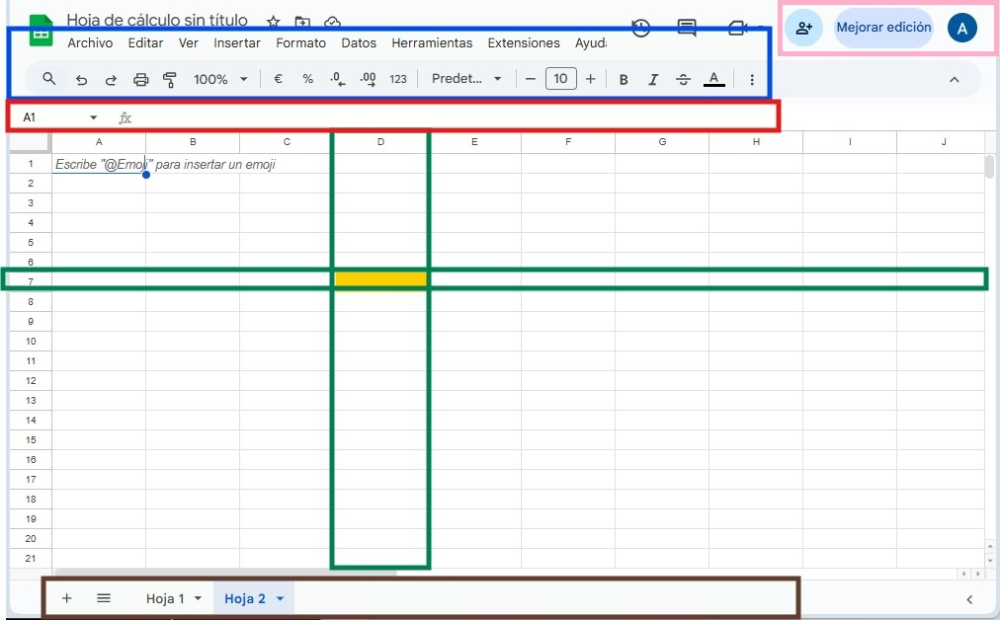
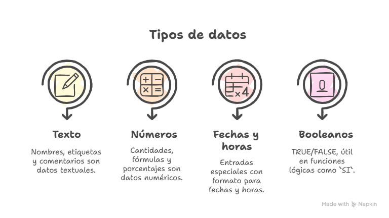
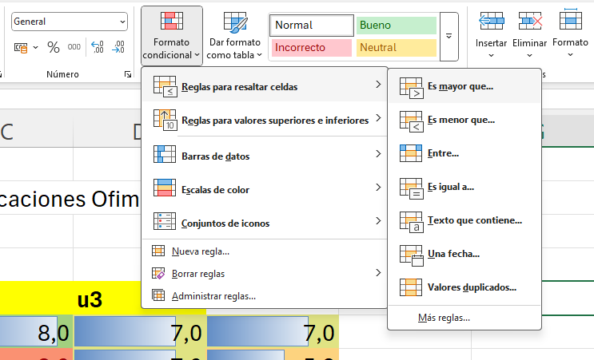
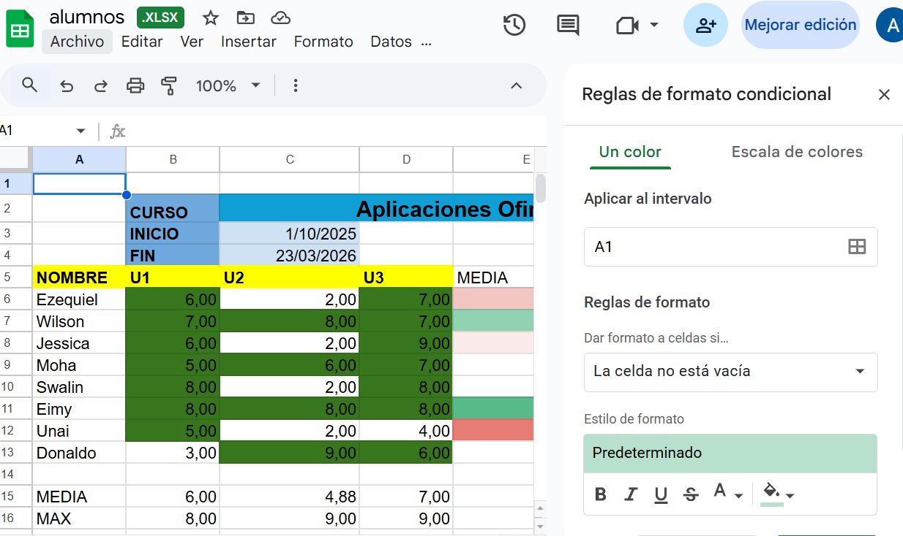

## Estructura Modular Dual (Excel y Google Sheets) - 50 Horas

[📖 Introducción a las hojas de Calculo](https://gamma.app/docs/Fundamentos-de-Hojas-de-Calculo-qcnzjzn589wnpxw?mode=doc)


### Módulo 1: Fundamentos (Aprox. 6 horas)

* **Concepto:** ¿Qué es una celda, fila, columna, hoja? (Idéntico).
* **Enfoque Dual: La Interfaz**
    * 🔵 **[Excel]:** La "Cinta de Opciones" (Ribbon). Mostrar captura.
    * 🟢 **[Google Sheets]:** La "Barra de Menús" (más clásica). Mostrar captura.
* **Concepto:** Introducción de datos (Texto, Números, Fechas) (Idéntico).
* **Enfoque Dual: El "Alcance" - Colaboración vs. Escritorio**
    * 🔵 **[Excel]:** Foco en el trabajo *offline* y potencia de escritorio. (Aunque Excel Online existe).
    * 🟢 **[Google Sheets]:** Foco en la **colaboración** en tiempo real. Este es su ADN. Debe ser el primer ejemplo práctico de Sheets (compartir un archivo y editarlo dos personas a la vez).

    [📕 Modulo 1](01-fundamentos.md)

### Módulo 2: Fórmulas y Funciones Básicas (Aprox. 8 horas)

* **Concepto:** `SUMA`, `PROMEDIO`, `MAX`, `MIN`, `CONTAR`, `CONTARA`.
* **Enfoque Dual:** ¡Ninguno! **Estas funciones son 100% idénticas.**
    * `=SUMA(A1:A10)` funciona exactamente igual en ambas.
    * Las referencias Relativas (A1) y Absolutas ($A$1) y el atajo F4 son idénticos.
* **Ejemplo Práctico:** El "Boletín de Notas" o "Gastos Mensuales" se construye igual en las dos.

[📕 Modulo 2](02-funciones-formulas-basica.md)


### Módulo 3: Formato y Presentación (Aprox. 6 horas)

* **Concepto:** Formato de moneda, porcentaje, bordes, alineación (Idéntico).
* **Enfoque Dual: Formato Condicional**
    * El concepto es el mismo ("si > 100, pintar en rojo").
    * **Implementación:** Los menús para configurarlo son diferentes. Aquí necesitas dos mini-tutoriales con capturas de pantalla lado a lado.
        * 🔵 **[Excel]:** *Inicio -> Formato Condicional -> Reglas...*
        * 🟢 **[Google Sheets]:** *Formato -> Formato Condicional -> Se abre panel lateral...*

[📕 Modulo 3](03-formatos.md)

### Módulo 4: Gestión de Datos (Aprox. 8 horas)

* **Concepto:** Ordenar y Filtrar (Idéntico).
* **Enfoque Dual: La Gran Diferencia**
    * 🔵 **[Excel]:** El poder de **"Formato como Tabla" (Ctrl+T)**. Esto es fundamental en Excel (rangos dinámicos, referencias estructuradas).
    * 🟢 **[Google Sheets]:** No tiene un "Formato como Tabla" equivalente. Su fortaleza son las **"Vistas de Filtro" (Filter Views)**, que permiten a un usuario filtrar datos sin afectar lo que ven los demás colaboradores. Esto es clave para el trabajo en equipo.
* **Enfoque Dual: Validación de Datos**
    * Concepto idéntico (crear listas desplegables).
    * Implementación: Los menús son diferentes. Requiere capturas de ambos.

[📕 Modulo 4](04-datos.md)

### Módulo 5: Funciones Intermedias (El "Alcance") (Aprox. 10 horas)

Aquí es donde el enfoque dual se vuelve más importante.

* **Concepto Común:** La lógica `SI` (IF) y `BUSCARV` (VLOOKUP) es idéntica.
* **Concepto Moderno Común:** `BUSCARX` (XLOOKUP) ya existe en ambas plataformas (en Excel 365 y Sheets). Es mejor enseñar esta que `BUSCARV`.
* **Enfoque Dual: Funciones Exclusivas (¡El "Alcance" real!)**
    * 🔵 **[Excel]:** Su poder radica en la integración con **Power Query** (para importar y transformar datos) y funciones más complejas de análisis de datos (que quizás se escapan de 50h, pero hay que mencionarlas).
    * 🟢 **[Google Sheets]:** Tiene funciones únicas que demuestran su "alcance" conectado a la web:
        * `QUERY`: La función "joya de la corona". Permite usar sintaxis de SQL para consultar datos. *Ejemplo: `=QUERY(A1:D100; "SELECT B, SUM(D) WHERE A = 'Ventas' GROUP BY B")`*.
        * `FILTER`: Una forma mucho más sencilla que en Excel (versiones antiguas) de filtrar datos con una fórmula.
        * `GOOGLEFINANCE`: Para traer datos de acciones bursátiles.
        * `IMPORTHTML`, `IMPORTXML`: Para "scrapear" datos (tablas, listas) de páginas web.
        * `GOOGLETRANSLATE`: Para traducir texto entre celdas.

### Módulo 6: Visualización de Datos (Gráficos) (Aprox. 6 horas)

* **Concepto:** Cuándo usar un gráfico de barras, líneas o circular (Idéntico).
* **Enfoque Dual: El Editor de Gráficos**
    * La creación es similar (Seleccionar datos -> Insertar Gráfico).
    * **Implementación:** Los paneles de edición son muy diferentes.
        * 🔵 **[Excel]:** Usa la "Cinta de Opciones" contextual (pestañas de Diseño y Formato) y el símbolo `+` junto al gráfico.
        * 🟢 **[Google Sheets]:** Usa un panel/editor lateral muy intuitivo.
    * *Mini-Exclusiva de Sheets:* Las funciones `SPARKLINE` (minigráficos dentro de una celda) son más directas y fáciles de usar en Sheets.

### Módulo 7: Tablas Dinámicas (Aprox. 6 horas)

* **Concepto:** Resumir grandes volúmenes de datos (Idéntico).
* **Enfoque Dual: El Panel de Control**
    * **Implementación:** El resultado es el mismo, pero la interfaz de creación difiere.
        * 🔵 **[Excel]:** El clásico panel "Campos de Tabla Dinámica" a la derecha, con áreas para arrastrar (Filtros, Columnas, Filas, Valores).
        * 🟢 **[Google Sheets]:** Un panel lateral "Editor de tablas dinámicas" que usa "Sugerencias" (IA) y áreas para "Añadir".
    * Ambas plataformas usan **Segmentación de Datos (Slicers)**, que son filtros visuales.

---

## Tabla Resumen para tu Documentación (El "Alcance")


| Característica | 🔵 Microsoft Excel | 🟢 Google Sheets |
| :--- | :--- | :--- |
| **Punto Fuerte** | Potencia de cálculo (Big Data), análisis offline, modelado financiero. | **Colaboración** en tiempo real, integración web, facilidad de acceso. |
| **Colaboración** | Posible (con Excel 365/Online) pero menos fluida. | **Nativa y superior**. Es su razón de ser. |
| **Funciones Únicas** | Funciones de Cubo, integración profunda con Power BI y Power Query. | `QUERY`, `FILTER`, `IMPORTHTML`, `GOOGLEFINANCE`, `GOOGLETRANSLATE`. |
| **Tablas de Datos** | **Tablas Estructuradas (Ctrl+T)** son superiores para gestionar datos. | **Vistas de Filtro** son superiores para colaborar sin molestarse. |
| **Rendimiento** | **Superior** para archivos muy grandes (cientos de miles de filas). | Más lento con archivos muy grandes, depende de la conexión a internet. |
| **Costo** | Licencia (Pago) | Gratuito |


## DOCUMENTACION 

### HOJAS DE CALCULO

### EXCEL

[Curso en video](https://www.youtube.com/watch?v=HqXjhC7WKHE&list=PLcKbSbJyOGOYVK5ey5vErm19tdvAvQSer)

 
### GOOGLE SHEET
# 🧩 MÓDULO 1: Fundamentos de las Hojas de Cálculo (Aprox. 6 horas)

> **Objetivo del módulo:** comprender los elementos básicos del entorno de trabajo de una hoja de cálculo y las diferencias esenciales entre Microsoft Excel y Google Sheets.

---

## 1.1 ¿Qué es una hoja de cálculo?

Las **hojas de cálculo** son herramientas digitales que permiten **organizar, procesar y analizar datos** en forma de tablas, utilizando celdas distribuidas en filas y columnas.

### Elementos básicos (idénticos en Excel y Sheets):

| Elemento    | Descripción                                                                                     |
| ----------- | ----------------------------------------------------------------------------------------------- |
| **Celda**   | Unidad básica. Es el espacio donde se introduce un dato. Tiene una referencia (A1, B2, etc.).   |
| **Fila**    | Conjunto horizontal de celdas (numeradas).                                                      |
| **Columna** | Conjunto vertical de celdas (letras).                                                           |
| **Hoja**    | Página de trabajo que contiene filas y columnas. Varias hojas pueden formar un libro o archivo. |
| **Libro**    | Archivo fisico o en la nube que contiene Hojas. |

---

## 1.2 Enfoque Dual: Conociendo la Interfaz

### 🔵 1.2.1 Microsoft Excel

#### Principales áreas de la interfaz

* **Cinta de Opciones** (Ribbon): barra superior con pestañas (Inicio, Insertar, Fórmulas, etc.).
* **Barra de fórmulas**: muestra y permite editar el contenido de una celda.
* **Panel de hojas**: pestañas para navegar entre diferentes hojas.




> 💡 **Actividad rápida:** Identifica y etiqueta visualmente al menos 5 elementos en una captura de Excel.

---

### 🟢 1.2.2 Google Sheets

#### Interfaz tradicional y ligera

* **Barra de menús**: estilo clásico, con menús desplegables como Archivo, Editar, Formato...
* **Barra de herramientas**: con acciones rápidas (negrita, formatos, funciones, etc.).
* **Panel lateral de colaboradores**: iconos con avatares mostrando quién está editando en tiempo real.



📷 **Incluir captura de pantalla de Google Sheets con etiquetas.**

> 💡 **Actividad rápida:** Cambia el idioma de la interfaz y localiza dónde están las opciones para gestionar permisos.

---

## 1.3 Introducción de datos básicos (idéntico)

### Tipos de datos:

1. **Texto:** nombres, etiquetas, comentarios.
2. **Números:** cantidades, fórmulas, porcentajes.
3. **Fechas y horas:** entradas especiales con formato.
4. **Booleanos:** TRUE/FALSE (útil en funciones lógicas como `SI`).




> ✍️ **Ejercicio práctico:**
> Escribe tu nombre, una fecha, un número y una fórmula básica (por ejemplo `=2+2`) en celdas distintas de Excel y Sheets.

---

## 1.4 Enfoque Dual: El "Alcance" de la herramienta

### 🔵 Excel: Potencia de escritorio

* Enfocado a **usuarios avanzados**, con grandes volúmenes de datos.
* Cuenta con características como macros, tablas dinámicas y herramientas de análisis profesional.
* Funciona **offline** (aunque existe *Excel Online*).
* Uso frecuente en empresas y entornos profesionales.

### 🟢 Google Sheets: Colaboración como ADN

* Pensado para trabajo en equipo **en tiempo real**, desde el navegador.
* Funciona con acceso a internet, sin necesidad de instalación.
* Control de versiones y comentarios integrados.
* Compartir es tan sencillo como pulsar un botón.

> 🧪 **Primer ejercicio diferencial (Google Sheets):**
> Crea una hoja de cálculo, compártela con un compañero y ambos modificadla al mismo tiempo. Observad cómo los cambios aparecen en tiempo real.

---

### ✔️ Resumen del módulo:

| Concepto       | Excel                           | Google Sheets                  |
| -------------- | ------------------------------- | ------------------------------ |
| Interfaz       | Ribbon / Cintas                       | Barra de menús                 |
| Trabajo        | Prioridad local                 | Prioridad en la nube           |
| Colaboración   | Limitada (Online mejorable)     | Nativa, en tiempo real         |
| Compatibilidad | Máxima en entornos corporativos | Integrado con Google Workspace |

> 🧩 **Pregunta guía para reflexión**:
> ¿Para qué tipo de tareas o proyectos elegirías cada herramienta?

## ENLACES 
https://support.google.com/a/users/answer/9282959?visit_id=638997436423519392-1814573353&hl=es&rd=1#sheets-quick-start


# 🧮 MÓDULO 2: Fórmulas, Funciones y Rangos Básicos (Aprox. 8 horas)

> **Objetivo del módulo:** aprender a trabajar con fórmulas esenciales, comprender el concepto de rangos de celdas y dominar referencias relativas, absolutas y mixtas.

---

## 2.1 Introducción a las Fórmulas

**¿Qué es una fórmula?**
Una fórmula realiza un cálculo. Siempre empieza con `=`.

> 🧠 *Ejemplo básico:*
> `=2+2` → Resultado: 4

---

## 2.2 ¿Qué es un Rango de Celdas?

Un **rango** es un grupo de celdas contiguas que se seleccionan como bloque.

### Tipos de rangos:

| Tipo                | Ejemplo       | Explicación                               |
| ------------------- | ------------- | ----------------------------------------- |
| Horizontal          | `A1:D1`       | Celdas de la 1ª fila, columnas A a D      |
| Vertical            | `B2:B8`       | Celdas de la columna B, filas 2 a 8       |
| Rectangular         | `A1:C3`       | Todas las celdas entre A1 y C3            |
| Rangos no contiguos | `A1:A3;C1:C3` | Selección de zonas separadas (solo Excel) |

> 🎯 **Importante:**
> Excel y Google Sheets gestionan los rangos de forma **idéntica**, tanto para selección como para uso en funciones.

---

## 2.3 Funciones Básicas con Rangos

Estas funciones se aplican **directamente sobre rangos** de datos:

| Función    | Uso                      | Ejemplo            |
| ---------- | ------------------------ | ------------------ |
| `SUMA`     | Suma valores             | `=SUMA(A1:A5)`     |
| `PROMEDIO` | Promedio                 | `=PROMEDIO(B2:B6)` |
| `MAX`      | Máximo                   | `=MAX(C1:C10)`     |
| `MIN`      | Mínimo                   | `=MIN(C1:C10)`     |
| `CONTAR`   | Cuenta valores numéricos | `=CONTAR(D1:D20)`  |
| `CONTARA`  | Cuenta celdas no vacías  | `=CONTARA(A1:A10)` |

> 🧪 **Ejercicio práctico 1:**
> Crea un rango de 10 valores numéricos (por ejemplo, A1:A10) y calcula:
>
> * La suma total.
> * El promedio.
> * El valor más alto.
> * El número de celdas no vacías.

---

## 2.4 Referencias de Celdas: Relativas, Absolutas y Mixtas

### 🔁 Relativas

Cambian al copiarse. Ejemplo: `=A1 + B1` se convierte en `=A2 + B2`.

### 📌 Absolutas

No cambian al copiarse. Ejemplo: `=$A$1 + B1` → `$A$1` siempre apunta a A1.

### 🌀 Mixtas

Parte fija, parte variable:

* `A$1` → fila fija
* `$A1` → columna fija

> 💡 **Atajo relevante (idéntico en Excel y Sheets):**
> Usa **F4** para alternar entre las diferentes formas de referencia.

> ✍️ **Ejercicio práctico 2:**
> Crea una tabla de multiplicar del 1 al 10 usando referencias absolutas.

---

## 2.5 Ejemplo Práctico: "Boletín de Notas" y "Gastos Mensuales"

### Boletín de Notas

| Alumno | Nota 1 | Nota 2 | Nota 3 | Promedio           |
| ------ | ------ | ------ | ------ | ------------------ |
| Ana    | 8      | 7      | 9      | `=PROMEDIO(B2:D2)` |
| Lucía  | ...    | ...    | ...    | ...                |

> 📝 Usar rangos: `B2:D2` → rango horizontal de tres notas.

---

### Control de Gastos Mensuales

| Categoría  | Enero | Febrero | Marzo | TOTAL          |
| ---------- | ----- | ------- | ----- | -------------- |
| Comida     | 350   | 380     | 400   | `=SUMA(B2:D2)` |
| Transporte | 45    | 60      | 50    | ...            |

> 💡 Usar rangos rectangulares (`B2:D5`) para el total de gastos.

---

## 2.6 Conclusión del Módulo

| Concepto                         | Excel & Sheets |
| -------------------------------- | -------------- |
| Rangos de celdas                 | Uso idéntico   |
| Sintaxis de funciones básicas    | Igual          |
| Referencias relativas/absolutas  | Igual          |
| Funciones aplicadas sobre rangos | Igual          |

> 🎯 **Clave del módulo:**
> Los rangos son la “base de operaciones” para todas las funciones. Sin ellos, la automatización y el análisis de datos no serían posibles.

## ENLACES

[📖Presentación Funciones](https://gamma.app/docs/Funciones-y-Argumentos-en-Excel-5ko0ub3gsdvdcv8)

[📹 Referencias en Excel](https://www.youtube.com/watch?v=hgST3sdvHOg&list=PLcKbSbJyOGOYVK5ey5vErm19tdvAvQSer&index=13)

[📖 Referencias avanzado](02-referencias-absolutas.md)


* Referencia **absoluta completa** (`$A$1`)
* Referencia **absoluta de columna** (`$A1`)
* Referencia **absoluta de fila** (`A$1`)


---

# 🔧 Referencias Absolutas: explicación + ejemplos de uso

Cuando arrastras una fórmula hacia abajo o hacia la derecha, Excel y Google Sheets **ajustan automáticamente** las referencias (referencia relativa).
Las referencias con `$` permiten **fijar** parte o toda la referencia.

---

# 🧱 1. Referencia Absoluta Completa

## 📌 **`$A$1` → fija columna y fila**

La celda **nunca cambia**, aunque arrastres la fórmula en cualquier dirección.

### 👉 Cuándo usarla

* Usar un valor fijo en toda la tabla (IVA, tipo de cambio, precio unitario fijo…)
* Usar constantes almacenadas en una celda
* Usar parámetros de un cálculo (fecha inicial, presupuesto total, límite máximo)

### 🧪 **Ejemplo práctico 1: IVA fijo**

```
Cantidad    Precio    IVA      Total
   2          10       0,21     =B2*C2 + C2*$D$1
```

Si el IVA está en `D1`, la fórmula del total será:

```
=B2 * $D$1
```

Copies donde copies → siempre tomará el IVA de `D1`.

---

# 🧭 2. Referencia Absoluta de Columna

## 📌 **`$A1` → fija la columna, pero NO la fila**

Es decir:

* Al arrastrar **a la derecha → no cambia la columna A**
* Al arrastrar **hacia abajo → sí cambia la fila**

### 👉 Cuándo usarla

* Cuando una columna representa un **valor de referencia vertical** que debe mantenerse
* Cuando comparas cada fila con un valor de la **misma columna**, pero la fila cambia
* Para cálculos que usan “series verticales” fijas

### 🧪 **Ejemplo práctico 2: Comparar cada valor con un objetivo**

Supongamos:

```
A (Objetivo)   B (Valor)   C (Resultado)
   50             45          
   50             60
   50             70
```

Objetivo está en `A1`, `A2`, `A3` (mismo valor repetido o no).

Fórmula en C2:

```
=B2 > $A2
```

Aquí fijamos **solo la columna A**, porque la columna es donde está el objetivo, pero la fila cambia según cada registro.

### Resultado esperado:

* Fila 2 → 45 > 50 → FALSO
* Fila 3 → 60 > 50 → VERDADERO
* Fila 4 → 70 > 50 → VERDADERO

---

# 🧭 3. Referencia Absoluta de Fila

## 📌 **`A$1` → fija la fila, pero NO la columna**

Es decir:

* Al arrastrar **hacia abajo → no cambia la fila 1**
* Al arrastrar **a la derecha → sí cambia la columna**

### 👉 Cuándo usarla

* Cuando la fila superior contiene **encabezados numéricos** (por ejemplo meses o porcentajes)
* Para usar una fila entera como referencia al crear fórmulas horizontales
* Para cálculos donde cada columna usa un valor fijo de la **fila superior**

### 🧪 **Ejemplo práctico 3: Usar porcentajes de la fila superior**

Supongamos:

```
       B      C      D
      Ene    Feb    Mar
Fila1 0,10   0,12   0,15   ← Porcentajes por mes (fila fija)
Fila2 200    300    500
Fila3 150    250    400
```

En B2 queremos aplicar el porcentaje de la **fila 1**:

En B2:

```
=B2 * B$1
```

Copiamos hacia la derecha, y obtenemos:

* En C2 → `=C2 * C$1`
* En D2 → `=D2 * D$1`

La fila “1” queda fija, porque queremos usar siempre los porcentajes de la fila superior.

---

# 🧩 Resumen Visual Rápido

| Referencia | Fila fija | Columna fija | Cuándo usar                                             |
| ---------- | --------- | ------------ | ------------------------------------------------------- |
| `$A$1`     | ✔️        | ✔️           | Valores totalmente fijos (IVA, tipo cambio, constantes) |
| `$A1`      | ❌         | ✔️           | Comparaciones verticales donde la columna es fija       |
| `A$1`      | ✔️        | ❌            | Usar encabezados de fila superior o series horizontales |

---

# 🧪 Mini–Ejercicio para el Aula

1. Crea una tabla 5×5 con números.
2. En una celda aparte escribe un valor fijo (por ejemplo “10”).
3. Calcula el **módulo** de cada número respecto a ese valor usando `$X$Y`.
4. Luego crea un encabezado de porcentajes en la fila superior y aplica `A$1`.
5. Crea una columna de objetivos y aplica `$A1`.

**➡️ El alumno verá claramente qué cambia y qué no al arrastrar.**

--- GEMINI ----
  # CASOS DE USO  

---

## 🤓 Referencia Absoluta Completa: `$A$1`

Una referencia de celda completamente absoluta, como `$A$1`, no cambia su columna ni su fila **nunca** al arrastrar o copiar la fórmula.

### 💰 Caso de Uso Real: Calcular un Impuesto Fijo o Tasa de Cambio

Imagina que tienes una lista de precios de productos y quieres calcular el **IVA (21%)** o aplicar una **tasa de cambio fija** a todos ellos.

| | **A** | **B** | **C** |
| :---: | :---: | :---: | :---: |
| **1** | **Tasa de IVA** | 21% | |
| **2** | **Producto** | **Precio Base (€)** | **Impuesto de IVA** |
| **3** | Silla | 100 | $=B3 * \$B\$1$ |
| **4** | Mesa | 250 | $=B4 * \$B\$1$ |
| **5** | Lámpara | 50 | $=B5 * \$B\$1$ |

**¿Por qué usar `$B$1`?**
* Queremos que, sin importar a qué fila copiemos la fórmula (de la fila 3 a la 4 y 5), **siempre** se refiera a la celda `B1` para obtener la tasa de IVA.
* Al copiar la fórmula de `C3` (que es `=B3 * $B$1`) a `C4`, la parte `B3` cambia a `B4` (referencia relativa), pero `$B$1` permanece **fija** como `$B$1`.
* Esto es útil porque si la tasa de IVA cambia (por ejemplo, a 25%), solo tienes que actualizar la celda `B1` y todos los cálculos se actualizarán automáticamente.

---

## ➡️ Referencia Absoluta de Columna: `$A1`

Una referencia absoluta de columna, como `$A1`, mantiene la **columna fija** al copiar la fórmula horizontalmente (hacia la derecha o izquierda), pero la **fila cambia** si se copia verticalmente (hacia abajo o arriba).

### 🏷️ Caso de Uso Real: Aplicar Descuentos Fijos por Producto

Supongamos que tienes una tabla donde aplicas diferentes porcentajes de descuento a los precios originales.

| | **A** | **B** | **C** | **D** |
| :---: | :---: | :---: | :---: | :---: |
| **1** | **Precio** | **-5% Desc.** | **-10% Desc.** | **-15% Desc.** |
| **2** | 100 | $= \$A2 * 0.95$ | $=\$A2 * 0.90$ | $=\$A2 * 0.85$ |
| **3** | 250 | | | |
| **4** | 50 | | | |

**¿Por qué usar `$A2`?**
* Al copiar la fórmula de `B2` a `C2` y `D2` (horizontalmente), queremos que **siempre** se refiera a la columna `A` para obtener el precio base, pero la fila debe ser la misma (fila 2). Así, `$A2` permanece `$A2`. Si fuese relativa (`A2`), cambiaría a `B2`, luego `C2`, lo cual estaría mal.
* Al copiar la fórmula de `B2` a `B3` (verticalmente), queremos que la referencia al precio **cambie** de la fila 2 a la fila 3. Así, `$A2` se convierte en `$A3`.
* La columna `A` está **bloqueada (`$A`)**, pero la fila **`2` no lo está** y cambia según sea necesario.

---

## ⬇️ Referencia Absoluta de Fila: `A$1`

Una referencia absoluta de fila, como `A$1`, mantiene la **fila fija** al copiar la fórmula verticalmente (hacia abajo o arriba), pero la **columna cambia** si se copia horizontalmente (hacia la derecha o izquierda).

### 📈 Caso de Uso Real: Cálculos Basados en Encabezados Fijos (Ejemplo de Comisiones)

Imagina que tienes una tabla de ventas y quieres calcular la comisión que obtienes por cada venta, donde la **tasa de comisión** está en la fila 1.

| | **A** | **B** | **C** | **D** |
| :---: | :---: | :---: | :---: | :---: |
| **1** | **Tasa** | **10%** | **15%** | **20%** |
| **2** | **Vendedor** | **Monto Venta (€)** | **Comisión** | **Comisión** |
| **3** | Juan | 1000 | | |
| **4** | María | 500 | | |

* Si ponemos en `C3` la fórmula `=B3 * C$1`:
* **Copia Vertical (de `C3` a `C4`):** Queremos que la **fila de la venta cambie** de `B3` a `B4`, pero que la tasa de comisión **se mantenga** en la fila `1`.
    * `B3` cambia a `B4` (relativo).
    * `C$1` permanece `C$1` (fila `1` bloqueada).
    * **Resultado en `C4`:** `=B4 * C$1`
* **Copia Horizontal (de `C3` a `D3`):** Queremos que la **columna de la tasa cambie** de la columna `C` (15%) a la columna `D` (20%), pero que la fila de la tasa **se mantenga** en la fila `1`.
    * `B3` permanece `B3` (el monto de la venta en la fila 3).
    * `C$1` cambia a `D$1` (columna `C` cambia a `D`, pero fila `1` bloqueada).
    * **Resultado en `D3`:** `=B3 * D$1`

---

## 📌 Resumen para Alumnos

| Tipo de Referencia | Ejemplo | ¿Qué queda **fijo** al copiar? | ¿Cuándo usarla? |
| :---: | :---: | :---: | :---: |
| **Relativa** | `A1` | **Nada** (Columna y Fila cambian) | Para celdas que se mueven con la fórmula (ej: un precio al lado). |
| **Absoluta Completa** | `$A$1` | **Columna y Fila** | Para una **constante única** (ej: IVA, Tasa de Cambio). |
| **Mixta (Columna Absoluta)** | `$A1` | **Columna** (Fila cambia) | Para fijar una columna de **datos de origen** (ej: columna de Precios). |
| **Mixta (Fila Absoluta)** | `A$1` | **Fila** (Columna cambia) | Para fijar una fila de **encabezados/tasas** (ej: fila de Comisiones). |

---

---------------------

## 📑 Referencias a Hojas (Internas)

Una referencia interna se usa cuando quieres vincular datos de una **hoja de cálculo diferente dentro del *mismo* archivo o libro de trabajo**. Este es el tipo de referencia más común.

### 💻 En Excel

El formato es directo y similar al de las referencias externas, pero **sin la parte del nombre del archivo** (los corchetes `[]`).

#### Formato

$$NombreDeLaHoja!CeldaORango$$

#### Reglas Importantes

1.  **Nombre de la Hoja:** Especifica el nombre de la hoja de donde provienen los datos.
2.  **El `!` (Signo de Exclamación):** Siempre separa el nombre de la hoja de la celda o rango.
3.  **Comillas Simples (`''`):** Son **obligatorias** si el nombre de la hoja contiene espacios o caracteres especiales.

#### Ejemplos

| Caso | Fórmula | Significado |
| :--- | :--- | :--- |
| **Hoja simple** | `=Ventas!A1` | Obtiene el valor de la celda A1 de la hoja llamada "Ventas". |
| **Hoja con espacios** | `='Datos 2023'!B5` | Obtiene el valor de la celda B5 de la hoja llamada "Datos 2023". |
| **Rango** | `=SUMA(Resumen!C:C)` | Suma todos los valores de la columna C en la hoja "Resumen". |

-----

### 🌐 En Google Sheets

El formato y la lógica son **exactamente los mismos** que en Excel para las referencias internas.

#### Formato

$$NombreDeLaHoja!CeldaORango$$

#### Reglas Importantes

  * Si el nombre de la hoja tiene espacios, debe estar entre comillas simples (`' '`).

#### Ejemplos

| Caso | Fórmula | Significado |
| :--- | :--- | :--- |
| **Hoja simple** | `=Inventario!H2` | Obtiene el valor de la celda H2 de la hoja "Inventario". |
| **Hoja con espacios** | `='Datos Brutos'!A10` | Obtiene el valor de la celda A10 de la hoja "Datos Brutos". |

-----

## 🌍 Referencias Externas (A otros archivos)

Como repaso, aquí tienes la explicación de cómo vincular datos de **otro archivo** (libro de trabajo o hoja de cálculo) diferente:

### 💻 Referencias Externas en Excel (Otro archivo .xlsx)

Una referencia externa en Excel requiere la ruta completa, incluyendo el nombre del archivo y la extensión, entre corchetes `[]`.

#### Formato de la Referencia

$$='\[NombreDelArchivo.extensión]NombreDeLaHoja'!CeldaORango$$

#### Ejemplo en Excel

```excel
='[InformeMensual.xlsx]Ventas'!A1
```

### 🌐 Referencias Externas en Google Sheets (Otro archivo de Sheets)

En Google Sheets, se usa la función **`IMPORTRANGE`** para vincular datos de una hoja de cálculo completamente diferente (otro archivo en Drive).

#### Función `IMPORTRANGE`

$$=IMPORTRANGE("URL_o_ID_de_la_hoja_de_calculo", "NombreDeLaHoja!CeldaORango")$$

#### Ejemplo en Google Sheets

```excel
=IMPORTRANGE("1a2b3c4d5e6f...", "DatosClientes!A1:B10")
```

(Recuerda que esta función requiere **autorización** la primera vez que se usa entre dos archivos específicos).# 🎨 MÓDULO 3: Formato y Presentación (Aprox. 6 horas)

> **Objetivo del módulo:** aprender a dar formato profesional a los datos y utilizar criterios visuales para facilitar la interpretación de la información.

---

## 3.1 Formato Básico de Celdas: Igual en ambas plataformas

Los conceptos son idénticos en Excel y Google Sheets:

### Tipos de Formato:

| Tipo                   | Descripción                            | Ejemplo Visual           |
| ---------------------- | -------------------------------------- | ------------------------ |
| **Moneda**             | Convierte números a formato de moneda. | `€1.234,56` o `$1234.56` |
| **Porcentaje**         | Muestra valores como porcentajes.      | `0.25` → `25%`           |
| **Fecha**              | Formato para valores de fecha.         | `01/12/2025`             |
| **Texto**              | Muestra contenido como texto literal.  | `Texto literal`          |
| **General/Automático** | El sistema detecta el tipo de dato.    | `123`                    |

---

## 3.2 Formatos Visuales: Bordes, Alineación y Color

| Formato                         | Excel (Cinta)                | Sheets (Menú o barra)                       |
| ------------------------------- | ---------------------------- | ------------------------------------------- |
| **Bordes**                      | Inicio → Bordes              | Barra de herramientas (icono de cuadrícula) |
| **Alineación**                  | Horizontal y vertical        | Idéntico (iconos)                           |
| **Color de relleno**            | Icono de cubo de pintura     | Igual (icono con cubo)                      |
| **Negrita, cursiva, subrayado** | Ctrl + B, Ctrl + I, Ctrl + U | Igual                                       |

> 📝 **Ejercicio práctico 1:** Crea una tabla, aplica bordes exteriores, un color de relleno a la cabecera y alinea el texto horizontal y verticalmente.

---

## 3.3 Formato Condicional: Enfoque Dual

> El concepto es idéntico: **"Si cumple una condición, aplica formato".**
> Donde cambia es en **cómo se activa y configura** en cada plataforma.

### 🔵 Microsoft Excel

1. Seleccionar el rango.
2. Ir a ***Inicio → Formato Condicional***.
3. Elige una regla (por ejemplo, **“Mayor que…”**).
4. Introducir el valor y aplicar formato.

📷 **(Captura recomendada)**: Menú 

---

### 🟢 Google Sheets

1. Seleccionar el rango.
2. Clic en ***Formato → Formato condicional***.
3. Se abre un **panel lateral** con opciones.
4. Añadir la condición (por ejemplo, **“La celda es mayor que 100”**).
5. Elegir el estilo con color de fondo o texto.

📷 ** Formato condicional google sheet**:
 

---

### Comparativa visual

| Aspecto               | Excel                          | Sheets                         |
| --------------------- | ------------------------------ | ------------------------------ |
| Dónde                 | Pestaña Inicio → Cinta         | Panel lateral después del menú |
| Reglas personalizadas | Sí                             | Sí                             |
| Vista previa          | Inmediata en la hoja           | Inmediata en la hoja           |
| Formatos aplicados    | Gran variedad (barras, iconos) | Más simple, pero claro         |

> ✍️ **Ejercicio práctico 2:**
> Crea un listado con valores numéricos. Usa formato condicional para:

* Resaltar en rojo los valores mayores a 100.
* Aplicar una escala de color de menor a mayor.
* (Opcional) Aplicar iconos en Excel.

---

## 3.4 Buenas prácticas de presentación

* **Usar colores con moderación**, que faciliten la lectura.
* **No saturar los bordes** o resaltar demasiado las celdas.
* Usar **estilos predefinidos** para mantener coherencia.
* Alinear correctamente y usar formato de tabla cuando aplica (👉 esto se aborda en Módulo 4 para Excel).

---

## 3.5 Mini Proyecto de Módulo: Presentación Profesional

> 🧪 **Mini Proyecto: Informe de Ventas / Resultados de Notas**

Crear una tabla con datos y aplicar los siguientes elementos:

| Elemento de Formato     | Objetivo                         |
| ----------------------- | -------------------------------- |
| Formato de moneda       | Para valores monetarios          |
| Encabezado destacado    | Fondo y negrita                  |
| Alineación adecuada     | Centrar títulos, alinear números |
| Formato condicional     | Resaltar valores fuera de rango  |
| Bordes y colores suaves | Dar estructura sin saturar       |

> 💡 **Bonus para alumnos con Sheets:** Compartir el documento con un compañero y aplicar reglas condicionales colaborativamente.

---

## 3.6 Conclusión del Módulo

| Concepto                                 | Excel & Sheets                           |
| ---------------------------------------- | ---------------------------------------- |
| Formatos básicos (texto, número, moneda) | Idénticos                                |
| Formato condicional                      | Concepto igual – implementación distinta |
| Estilos                                  | Excel ofrece más opciones                |
| Flujo de trabajo                         | Sheets simplifica con panel lateral      |

> 🎯 **Clave del módulo:** Saber dar formato a los datos mejora la interpretación y transmisión de la información. El formato condicional puede convertir números en decisiones visuales.

# 📊 MÓDULO 4: Gestión de Datos (Aprox. 8 horas)

> **Objetivo del módulo:** aprender a ordenar, filtrar y estructurar datos de forma profesional. Entender las diferencias clave entre Excel y Google Sheets en la gestión de datos.

---

# 4.1 Concepto: Ordenar y Filtrar

*(Idéntico en Excel y Google Sheets)*

Ordenar y filtrar datos son dos de las herramientas más utilizadas en cualquier hoja de cálculo.

### 🔢 Ordenación

Permite reorganizar filas según una o varias columnas:

* Orden ascendente (A→Z, menor→mayor).
* Orden descendente (Z→A, mayor→menor).
* Orden personalizado (por ejemplo: “Pendiente → En curso → Finalizado”).

### 🔍 Filtrado

Permite mostrar solo las filas que cumplen una condición.

Ejemplos de filtros comunes:

* “Mostrar solo los valores > 100”
* “Mostrar productos de la categoría Comida”
* “Mostrar las fechas del último mes”

> 📝 **Ejemplo práctico:**
> Realiza un filtro para mostrar únicamente los gastos superiores a 50 €.

---

# 4.2 Enfoque Dual: La Gran Diferencia

Aquí aparece una de las diferencias **más importantes** entre Excel y Google Sheets.

---

## 🔵 Excel: *Formato como Tabla* (Ctrl + T)

Excel incluye una función clave: **Formato como tabla**.

### ¿Qué aporta?

* Rangos **dinámicos** (la tabla se expande automáticamente).
* Filtros integrados en los encabezados.
* Estilos profesionales instantáneos.
* **Referencias estructuradas** → en lugar de `A2:A100`, puedes usar `Ventas[Importe]`.
* Totales automáticos.
* Integración con Power Query.

### ¿Cómo activarlo?

1. Seleccionar un rango con datos.
2. Pulsar **Ctrl + T**.
3. Confirmar “La tabla tiene encabezados”.

📘 **Resultado:** Obtienes una tabla inteligente y flexible, ideal para análisis.

> 💡 **Consejo para alumnos:**
> Si trabajas con grandes volúmenes de datos en Excel… **usa SIEMPRE tablas**.

---

## 🟢 Google Sheets: *Vistas de Filtro*

Google Sheets no tiene un “Formato como tabla”, pero sí una alternativa muy poderosa para equipos:

### ⭐ Vistas de filtro

Permiten que **cada usuario vea sus propios filtros** sin afectar al resto.
Esto es esencial en documentos colaborativos.

### ¿Qué permiten hacer?

* Crear múltiples vistas (por usuario, por periodo, por filtro específico).
* Guardar filtros personalizados.
* Mantener intacta la visión del resto de personas que están editando.

### ¿Cómo crear una?

1. Menú **Datos → Vistas de filtro → Crear nueva vista de filtro**.
2. Aparece un marco oscuro que indica que estás creando tu vista privada.
3. Aplicar filtros sin afectar al resto.

> 💡 **Ideal para trabajos en equipo:**
> Cada alumno puede filtrar su parte de la tabla sin molestar al resto.

---

# 4.3 Enfoque Dual: Validación de Datos (Listas Desplegables)

> El concepto es idéntico: **limitar lo que se puede escribir en una celda**.

Usado para:

* Menús desplegables.
* Controlar que los valores sean correctos.
* Evitar errores al introducir datos.

---

## 🔵 Excel – Validación de Datos

Ruta:
**Datos → Validación de datos**

Opciones comunes:

* Lista de valores
* Número entero / decimal
* Fecha
* Longitud del texto
* Mensaje de entrada
* Mensaje de error

📘 **Ejemplo:**
Crear una lista desplegable con categorías:
“Alimentación, Transporte, Ocio”.

---

## 🟢 Google Sheets – Validación de Datos

Ruta:
**Datos → Validación de datos**

Similitudes:

* Listas
* Intervalos
* Criterios personalizados

Diferencias:

* El panel es lateral y más visual.
* Permite “Mostrar advertencia” en lugar de bloquear el dato.
* Integra mejor con rangos dinámicos en la nube.

---

# 4.4 Ejercicios del Módulo

### ✔️ Ejercicio 1: Ordenación

Ordena una tabla de productos por precio (de mayor a menor) y luego por categoría alfabética.

### ✔️ Ejercicio 2: Filtros básicos

Filtra una lista para mostrar solo los gastos de tipo “Transporte”.

### ✔️ Ejercicio 3 (Excel): Formato como tabla

Convierte un rango de datos en una tabla con **Ctrl + T**.
Aplica un estilo y activa la fila de totales.

### ✔️ Ejercicio 4 (Sheets): Vista de filtro

Crea una vista de filtro llamada “Mis datos” en un archivo compartido.
Filtra solo los registros del mes de enero.

### ✔️ Ejercicio 5: Validación de datos

Crea una lista desplegable con categorías y aplícala a toda una columna.

---

# 4.5 Conclusión del Módulo

| Tema                 | Excel                           | Sheets                      |
| -------------------- | ------------------------------- | --------------------------- |
| Ordenar y filtrar    | Igual                           | Igual                       |
| Herramienta estrella | **Formato como Tabla (Ctrl+T)** | **Vistas de filtro**        |
| Colaboración         | Menos fluida                    | Superior (filtros privados) |
| Listas desplegables  | Validación de datos clásica     | Validación + avisos         |

> 🎯 **Clave del módulo:**
> Excel es imbatible estructurando datos, Sheets es imbatible colaborando. Debes dominar ambas herramientas para un uso profesional.


---

# 🧠 MÓDULO 5: Funciones Intermedias – El “Alcance” de Cada Plataforma

**Duración estimada:** 10 horas

> **Objetivo del módulo:**
> Explorar funciones intermedias que permiten tomar decisiones, buscar datos y trabajar con análisis más avanzados. Este módulo muestra claramente las **similitudes** entre Excel y Google Sheets, y sobre todo sus **diferencias de alcance**, donde cada uno destaca en un ámbito distinto.

---


# 5.1 Concepto Común: Funciones Lógicas y de Búsqueda

Estas funciones funcionan *idénticas* en Excel y Google Sheets.

---

## ✔️ 5.1.1 Función `SI` (IF) – Lógica básica

### Sintaxis

```
=SI(condición; valor_si_verdadero; valor_si_falso)
```

### Ejemplo

```
=SI(B2>=5; "Aprobado"; "Suspenso")
```

### Caso práctico

En una tabla de notas, crear una columna que indique el estado del alumno.

---

## ✔️ 5.1.2 Función `BUSCARV` (VLOOKUP) – Versión clásica

> Se incluye por compatibilidad con el mundo profesional.

### Sintaxis

```
=BUSCARV(valor; rango; columna; coincidencia_exacta_o_aproximada)
```

### Ejemplo

Buscar el precio de un producto según su código:

```
=BUSCARV(A2; Productos!A2:C100; 3; FALSO)
```

---

## ✔️ 5.1.3 Función `BUSCARX` (XLOOKUP) – Versión moderna (RECOMENDADA)

> Ya existe tanto en Excel 365 como en Google Sheets, con la **misma** sintaxis.

### Sintaxis

```
=BUSCARX( valor_buscado; rango_busqueda; rango_devolución )
```

### Ejemplo

```
=BUSCARX(A2; Productos!A:A; Productos!C:C)
```

✔ Más flexible
✔ Permite búsquedas bidireccionales
✔ No depende de la columna “hacia la derecha”

---

# 5.2 Enfoque Dual: Funciones Exclusivas – El Verdadero “Alcance”

Este es el punto clave del módulo: **cada plataforma tiene funciones exclusivas que muestran para qué mundo está diseñada.**

---

# 💙 5.3 Área Excel: Potencia de Procesamiento Local

## 🔵 5.3.1 Mención especial: **Power Query** (no se desarrolla en un curso de 50h, solo se introduce)

Power Query permite:

* Importar datos de archivos CSV, XML, JSON.
* Limpiar, transformar y combinar tablas.
* Automatizar procesos de carga.

> Excel es ideal para análisis pesado y modelado de datos en entornos corporativos.

---

## 🔵 5.3.2 Funciones útiles de Excel

Aunque no todas se profundizan, conviene mencionarlas:

* `SUMAR.SI`
* `SUMAR.SI.CONJUNTO`
* `CONTAR.SI`
* `CONTAR.SI.CONJUNTO`
* `INDICE` + `COINCIDIR`

> Excel destaca en **gran volumen de datos**, modelos financieros y automatización.

---

# 💚 5.4 Área Google Sheets: Su “Alcance Conectado a la Web”

Google Sheets brilla cuando se trata de **datos online**, automatización ligera y trabajo colaborativo.

## 🟢 5.4.1 Función estrella: `QUERY`

### ¿Por qué es tan potente?

Porque permite usar **SQL** directamente dentro de una hoja de cálculo.

### Ejemplo

Tabla con columnas A (Mes), B (Vendedor), C (Ventas):

```
=QUERY(A1:C100; "SELECT B, SUM(C) GROUP BY B ORDER BY SUM(C) DESC")
```

Obtienes:

* Ventas totales por vendedor
* Ordenadas de mayor a menor
* Sin fórmulas adicionales

🎯 **Query es la función más poderosa de Sheets.**

---

## 🟢 5.4.2 `FILTER` – Filtrar con fórmula (más fácil que en Excel clásico)

Ejemplo:

```
=FILTER(A2:C100; C2:C100>1000)
```

Filtra todas las filas donde las ventas > 1000.

---

## 🟢 5.4.3 `GOOGLEFINANCE` – Datos bursátiles en tiempo real

Ejemplo:
Precio actual:

```
=GOOGLEFINANCE("GOOG"; "price")
```

Histórico:

```
=GOOGLEFINANCE("AAPL"; "close"; HOY()-30; HOY())
```

---

## 🟢 5.4.4 `IMPORTHTML` – Importar tablas y listas desde una web

Ejemplo:

```
=IMPORTHTML("https://es.wikipedia.org/wiki/Econom%C3%ADa_de_Espa%C3%B1a"; "table"; 1)
```

---

## 🟢 5.4.5 `IMPORTXML` – Scraping avanzado

Permite extraer datos específicos con XPath.

Ejemplo:

```
=IMPORTXML("https://news.ycombinator.com"; "//a/@href")
```

---

## 🟢 5.4.6 `GOOGLETRANSLATE` – Traducción automática

```
=GOOGLETRANSLATE(A2; "es"; "en")
```

---

# 5.5 Ejercicios del Módulo

### ✔️ Ejercicio 1 – Lógica `SI`

Crear una columna “Estado” basada en la nota del alumno usando la función `SI`.

### ✔️ Ejercicio 2 – `BUSCARX`

En un listado de productos, traer el precio desde otra hoja.

### ✔️ Ejercicio 3 – Análisis con Query (Sheets)

Dado un listado de ventas:

* Mostrar total vendido por vendedor
* Ordenarlo de mayor a menor
* Filtrar solo un producto

### ✔️ Ejercicio 4 – `FILTER` (Sheets)

Filtrar todos los registros donde el importe > 500.

### ✔️ Ejercicio 5 – Importación desde web (Sheets)

Usar `IMPORTHTML` para traer una tabla de Wikipedia.

### ✔️ Ejercicio 6 – Excel SUMAR.SI.CONJUNTO

Sumar todas las ventas del vendedor “María” en el mes de enero.

---

# 5.6 Conclusión del Módulo

| Tema                           | Excel                                 | Sheets                        |
| ------------------------------ | ------------------------------------- | ----------------------------- |
| Función SI / BUSCARV / BUSCARX | Idénticas                             | Idénticas                     |
| Potencia                       | Procesamiento local + Power Query     | Conexión web + automatización |
| Funciones exclusivas           | Modelos financieros, transformaciones | Query, Import*, GoogleFinance |

> 🎯 **Idea clave del módulo:**
> Excel es una herramienta de análisis pesado en local; Google Sheets es una herramienta conectada, colaborativa y flexible. Dominar ambos mundos amplía tu “alcance profesional”.

---

Aquí tienes el **Módulo 6 completo** siguiendo el índice original, con enfoque dual Excel / Google Sheets, contenido pedagógico, ejemplos prácticos y ejercicios.

---

# 📈 MÓDULO 6: Visualización de Datos (Gráficos)

**Duración estimada:** 6 horas

> **Objetivo del módulo:**
> Aprender a representar datos visualmente mediante gráficos, elegir el tipo adecuado según el propósito y comprender las diferencias entre los editores de gráficos de Excel y Google Sheets.

---

# 6.1 ¿Por qué usar gráficos?

Los gráficos permiten:

* Detectar tendencias.
* Comparar valores.
* Encontrar patrones rápidamente.
* Presentar resultados de forma visual y comprensible.

---

# 6.2 Tipos de gráficos más comunes (idénticos en Excel y Sheets)

| Tipo de gráfico       | Cuándo usarlo                                 |
| --------------------- | --------------------------------------------- |
| **Barras / Columnas** | Comparaciones entre categorías.               |
| **Líneas**            | Evolución en el tiempo (mensual, anual…).     |
| **Circular (tarta)**  | Distribución porcentual.                      |
| **Área**              | Acumulación de valores a lo largo del tiempo. |
| **Dispersión (XY)**   | Relaciones entre variables numéricas.         |

> 🎓 Recomendación didáctica:
> No mezclar demasiados colores, ni usar gráficos 3D (aportan ruido visual y suelen dificultar la lectura).

---

# 6.3 Crear un gráfico: Pasos comunes (Excel y Sheets)

1. Seleccionar los **datos** (encabezados incluidos).
2. Menú **Insertar → Gráfico**.
3. Elegir tipo de gráfico.
4. Aplicar ajustes:

   * Títulos
   * Etiquetas
   * Leyendas
   * Colores
   * Formato

---

# 6.4 Enfoque Dual: El Editor de Gráficos

Aquí aparecen diferencias importantes entre las plataformas.

---

## 🔵 6.4.1 Excel: Cinta de Opciones + Panel contextual

Excel usa una combinación de:

### 1) **Cinta de opciones (pestañas contextualizadas)**

Aparecen nuevas pestañas cuando seleccionas un gráfico:

* **Diseño del gráfico**
* **Formato**

Incluyen herramientas para:

* Cambiar tipo de gráfico
* Seleccionar datos
* Estilos rápidos
* Agregar elementos del gráfico

### 2) **El botón “+” junto al gráfico**

Permite añadir o quitar:

* Títulos
* Etiquetas de datos
* Líneas de tendencia
* Leyenda
* Barras de error

📘 **Ventaja:** Excel ofrece más control de formato y mejor acabado visual profesional.

---

## 🟢 6.4.2 Google Sheets: Panel lateral intuitivo

En Google Sheets, al insertar un gráfico se abre un **panel lateral** dividido en:

### **Configurar**

* Tipo de gráfico
* Rango de datos
* Series
* Eje horizontal / vertical

### **Personalizar**

* Estilo del gráfico
* Etiquetas
* Leyenda
* Series
* Bordes
* Fondo

📘 **Ventaja:** Muy fácil de usar, ideal para aprendizaje rápido y edición colaborativa.

---

# 6.5 Funciones especiales en Google Sheets: Mini-gráficos con SPARKLINE

Google Sheets incluye una función exclusiva:

## `SPARKLINE`

Inserta un pequeño gráfico dentro de una celda.

### Ejemplo:

```
=SPARKLINE(B2:M2)
```

### Tipos compatibles:

* Línea
* Barra
* Ganancias/pérdidas

🎯 **Excelente para dashboards o resumen de tendencias.**

---

# 6.6 Buenas prácticas al crear gráficos

* Usa **títulos claros** (“Ventas por mes 2024”).
* Mantén los colores consistentes (mismo color para la misma categoría).
* No sobrecargues el gráfico de etiquetas.
* Evita la decoración innecesaria.
* Asegúrate de que el gráfico responde a una **pregunta clara**.

---

# 6.7 Casos prácticos paso a paso

## ✔️ Caso 1: Gráfico de barras – Ventas por producto

1. Crear una tabla con productos y ventas.
2. Seleccionar la tabla.
3. Insertar un gráfico de columnas.
4. Añadir título: “Ventas por producto”.
5. Ordenar los datos antes o después según convenga.

---

## ✔️ Caso 2: Gráfico de líneas – Evolución de ingresos

1. Tabla con meses (enero–diciembre) y valores.
2. Insertar gráfico → “Gráfico de líneas”.
3. Personalizar colores.
4. Añadir etiquetas de datos solo si son necesarias.

---

## ✔️ Caso 3: Gráfico circular – Distribución de gastos

1. Tabla con categorías y porcentajes.
2. Insertar gráfico de sectores.
3. Activar las “Etiquetas de porcentaje”.

---

## ✔️ Caso 4: Mini-gráficos SPARKLINE (Sheets)

En una tabla de ventas mensuales por vendedor:

```
Vendedor | Ene | Feb | Mar | ... | Mini-grafico
Ana      | 120 | 140 | 160 | ... | =SPARKLINE(B2:M2)
```

---

# 6.8 Ejercicios del módulo

## 📝 Ejercicio 1: Gráfico de columnas

Crea un gráfico de columnas para comparar las ventas de cinco productos.

## 📝 Ejercicio 2: Gráfico de líneas

Con una tabla mensual, crea un gráfico de líneas que muestre la evolución de ingresos.

## 📝 Ejercicio 3: Gráfico circular

Representa cómo se distribuye un presupuesto mensual entre categorías.

## 📝 Ejercicio 4: Personalización (Excel vs Sheets)

Replica el mismo gráfico en ambas plataformas y describe qué diferencias encuentras en:

* panel de edición
* opciones avanzadas
* estilo final

## 📝 Ejercicio 5 (Sheets): SPARKLINE

Genera un mini-gráfico dentro de una celda con la tendencia de ventas de un vendedor.

---

# 6.9 Conclusión del módulo

| Tema              | Excel                       | Sheets                      |
| ----------------- | --------------------------- | --------------------------- |
| Tipos de gráficos | Idénticos                   | Idénticos                   |
| Editor            | Más profesional y detallado | Más simple e intuitivo      |
| Mini-gráficos     | Menos directos              | `SPARKLINE` integrado       |
| Colaboración      | Compartible                 | Colaboración en tiempo real |

> 🎯 **Idea clave:**
> Dominar los gráficos permite convertir datos en historias. Excel ofrece un acabado profesional; Google Sheets destaca en simplicidad y rapidez.

S# 🔄 MÓDULO 7: Tablas Dinámicas

**Duración estimada:** 6 horas

> **Objetivo del módulo:**
> Aprender a resumir grandes volúmenes de datos de forma flexible mediante tablas dinámicas y comprender las diferencias entre Excel y Google Sheets en su creación y edición.

---

# 7.1 ¿Qué es una tabla dinámica?

Una tabla dinámica es una herramienta que permite:

* **Resumir** grandes conjuntos de datos.
* **Agrupar** información por categorías.
* **Reorganizar** los datos en segundos (arrastrar/soltar).
* **Aplicar cálculos automáticos** como suma, promedio, conteo.
* **Filtrar** y **segmentar** datos de forma visual.

> **Idea clave:**
> Una tabla dinámica NO altera los datos originales; solo muestra un resumen dinámico.

---

# 7.2 Componentes de una tabla dinámica (idénticos en Excel y Sheets)

Todas las tablas dinámicas tienen:

* **Filas:** categorías principales (ej. vendedores, productos).
* **Columnas:** subcategorías (ej. meses, regiones).
* **Valores:** cálculos (suma, promedio, conteo).
* **Filtros:** para incluir/excluir categorías.
* **Segmentadores/Slicers:** filtros visuales (botones).

Ejemplo de estructura típica:

```
Filas: Vendedor
Columnas: Mes
Valores: Suma de Ventas
Filtros: Región
```

---

# 7.3 Crear una tabla dinámica

## Pasos comunes (Excel y Sheets)

1. Seleccionar el rango de datos.
2. Ir a **Insertar → Tabla dinámica**.
3. Elegir:

   * Nueva hoja
   * Hoja existente
4. Añadir campos a las áreas: Filas, Columnas, Valores, Filtros.

---

# 7.4 Enfoque Dual: Diferencias entre Excel y Google Sheets

---

## 🔵 Excel: Panel de Campos de Tabla Dinámica

Excel utiliza un panel a la derecha de la pantalla con áreas claramente organizadas:

* **Filtros**
* **Columnas**
* **Filas**
* **Valores**

Además, incorpora:

* Diseño tabular
* Estilos rápidos
* Actualización automática
* Cambiar el cálculo (suma, promedio, etc.)
* Agrupación por fechas (años, trimestres, meses)
* Segmentadores visuales muy avanzados

📘 **Ventaja:** Excel es más potente para análisis profesional, contabilidad, BI básico y grandes volúmenes.

---

## 🟢 Google Sheets: Editor lateral simplificado

Sheets abre un panel lateral con dos secciones:

### **1) Configurar**

* Rango de datos
* Filas
* Columnas
* Valores
* Filtros

### **2) Sugerencias (IA integrada)**

Sheets propone automáticamente:

* “Total por categoría”
* “Promedio por mes”
* “Productos más vendidos”

📘 **Ventaja:** Muy intuitivo, ideal para estudiantes principiantes y trabajo colaborativo.

---

# 7.5 Segmentadores / Slicers

Ambas plataformas permiten añadir **segmentadores**, que son filtros visuales.

### ✔️ En Excel

Insertar → Segmentación de datos
Permite:

* Filtrar por botón
* Combinar varios segmentadores
* Estilos visuales avanzados

### ✔️ En Google Sheets

Datos → Añadir Segmentador
Permite:

* Filtrar por valores
* Conectarse a la tabla dinámica o al rango original
* Funciona muy bien en entornos colaborativos

---

# 7.6 Agrupación de datos (Excel vs. Sheets)

| Acción                        | Excel                             | Sheets                           |
| ----------------------------- | --------------------------------- | -------------------------------- |
| Agrupar fechas por año/mes    | ✔️ Automático al arrastrar fechas | ✔️ Manual mediante “Agrupar por” |
| Agrupar números en intervalos | ✔️ Muy potente                    | ✖️ Limitado                      |
| Expandir/contraer categorías  | ✔️ Sí                             | ✔️ Sí                            |

---

# 7.7 Casos prácticos paso a paso

---

## ✔️ Caso 1: Resumen de ventas por vendedor

Dado un rango con columnas: Fecha – Vendedor – Producto – Importe

**Configurar:**

* Filas → Vendedor
* Valores → Suma del Importe

---

## ✔️ Caso 2: Ventas por mes y producto

* Filas → Producto
* Columnas → Mes
* Valores → Suma del Importe

Excel agrupará las fechas automáticamente.
Sheets permite agruparlas desde el panel lateral.

---

## ✔️ Caso 3: Filtro por región

* Filtros → Región
* Comprobar cómo cambia el resumen según la región seleccionada.

---

## ✔️ Caso 4: Segmentador visual (Slicer)

(Excel)
Insertar → Segmentación → Seleccionar “Vendedor”.

(Sheets)
Datos → Añadir segmentador → Conectar con la tabla dinámica.

---

## ✔️ Caso 5: Analizar solo los 5 productos más vendidos

* Añadir una columna auxiliar “Ventas Totales” (si fuera necesario).
* Ordenar dentro de la tabla dinámica.
* Filtrar por “Top 5”.

---

# 7.8 Ejercicios del módulo

### 📝 Ejercicio 1

Crea una tabla dinámica que muestre las ventas totales por producto.

### 📝 Ejercicio 2

Muestra la suma de ventas por vendedor y mes.

### 📝 Ejercicio 3

Añade un filtro de fecha para ver solo las ventas del último trimestre.

### 📝 Ejercicio 4

Inserta un segmentador para filtrar por producto.

### 📝 Ejercicio 5

En Google Sheets, crea una tabla dinámica usando **Sugerencias**, y describe qué te ha generado la IA.

---

# 7.9 Conclusión del módulo

| Tema             | Excel                        | Sheets                          |
| ---------------- | ---------------------------- | ------------------------------- |
| Complejidad      | Muy alto                     | Medio                           |
| Potencia         | Superior (análisis avanzado) | Excelente para uso colaborativo |
| Panel de control | Muy completo                 | Simple, intuitivo               |
| Segmentadores    | Muy potentes                 | Modernos y colaborativos        |

> 🎯 **Idea clave:**
> Excel es la referencia profesional para análisis con tablas dinámicas; Google Sheets es ideal para practicidad, rapidez y trabajo en equipo.


## Estructura Modular Dual (Excel y Google Sheets) - 50 Horas

[📖 Introducción a las hojas de Calculo](https://gamma.app/docs/Fundamentos-de-Hojas-de-Calculo-qcnzjzn589wnpxw?mode=doc)


### Módulo 1: Fundamentos (Aprox. 6 horas)

* **Concepto:** ¿Qué es una celda, fila, columna, hoja? (Idéntico).
* **Enfoque Dual: La Interfaz**
    * 🔵 **[Excel]:** La "Cinta de Opciones" (Ribbon). Mostrar captura.
    * 🟢 **[Google Sheets]:** La "Barra de Menús" (más clásica). Mostrar captura.
* **Concepto:** Introducción de datos (Texto, Números, Fechas) (Idéntico).
* **Enfoque Dual: El "Alcance" - Colaboración vs. Escritorio**
    * 🔵 **[Excel]:** Foco en el trabajo *offline* y potencia de escritorio. (Aunque Excel Online existe).
    * 🟢 **[Google Sheets]:** Foco en la **colaboración** en tiempo real. Este es su ADN. Debe ser el primer ejemplo práctico de Sheets (compartir un archivo y editarlo dos personas a la vez).

    [📕 Modulo 1](01-fundamentos.md)

### Módulo 2: Fórmulas y Funciones Básicas (Aprox. 8 horas)

* **Concepto:** `SUMA`, `PROMEDIO`, `MAX`, `MIN`, `CONTAR`, `CONTARA`.
* **Enfoque Dual:** ¡Ninguno! **Estas funciones son 100% idénticas.**
    * `=SUMA(A1:A10)` funciona exactamente igual en ambas.
    * Las referencias Relativas (A1) y Absolutas ($A$1) y el atajo F4 son idénticos.
* **Ejemplo Práctico:** El "Boletín de Notas" o "Gastos Mensuales" se construye igual en las dos.

[📕 Modulo 2](02-funciones-formulas-basica.md)


### Módulo 3: Formato y Presentación (Aprox. 6 horas)

* **Concepto:** Formato de moneda, porcentaje, bordes, alineación (Idéntico).
* **Enfoque Dual: Formato Condicional**
    * El concepto es el mismo ("si > 100, pintar en rojo").
    * **Implementación:** Los menús para configurarlo son diferentes. Aquí necesitas dos mini-tutoriales con capturas de pantalla lado a lado.
        * 🔵 **[Excel]:** *Inicio -> Formato Condicional -> Reglas...*
        * 🟢 **[Google Sheets]:** *Formato -> Formato Condicional -> Se abre panel lateral...*

[📕 Modulo 3](03-formatos.md)

### Módulo 4: Gestión de Datos (Aprox. 8 horas)

* **Concepto:** Ordenar y Filtrar (Idéntico).
* **Enfoque Dual: La Gran Diferencia**
    * 🔵 **[Excel]:** El poder de **"Formato como Tabla" (Ctrl+T)**. Esto es fundamental en Excel (rangos dinámicos, referencias estructuradas).
    * 🟢 **[Google Sheets]:** No tiene un "Formato como Tabla" equivalente. Su fortaleza son las **"Vistas de Filtro" (Filter Views)**, que permiten a un usuario filtrar datos sin afectar lo que ven los demás colaboradores. Esto es clave para el trabajo en equipo.
* **Enfoque Dual: Validación de Datos**
    * Concepto idéntico (crear listas desplegables).
    * Implementación: Los menús son diferentes. Requiere capturas de ambos.

[📕 Modulo 4](04-datos.md)

### Módulo 5: Funciones Intermedias (El "Alcance") (Aprox. 10 horas)

Aquí es donde el enfoque dual se vuelve más importante.

* **Concepto Común:** La lógica `SI` (IF) y `BUSCARV` (VLOOKUP) es idéntica.
* **Concepto Moderno Común:** `BUSCARX` (XLOOKUP) ya existe en ambas plataformas (en Excel 365 y Sheets). Es mejor enseñar esta que `BUSCARV`.
* **Enfoque Dual: Funciones Exclusivas (¡El "Alcance" real!)**
    * 🔵 **[Excel]:** Su poder radica en la integración con **Power Query** (para importar y transformar datos) y funciones más complejas de análisis de datos (que quizás se escapan de 50h, pero hay que mencionarlas).
    * 🟢 **[Google Sheets]:** Tiene funciones únicas que demuestran su "alcance" conectado a la web:
        * `QUERY`: La función "joya de la corona". Permite usar sintaxis de SQL para consultar datos. *Ejemplo: `=QUERY(A1:D100; "SELECT B, SUM(D) WHERE A = 'Ventas' GROUP BY B")`*.
        * `FILTER`: Una forma mucho más sencilla que en Excel (versiones antiguas) de filtrar datos con una fórmula.
        * `GOOGLEFINANCE`: Para traer datos de acciones bursátiles.
        * `IMPORTHTML`, `IMPORTXML`: Para "scrapear" datos (tablas, listas) de páginas web.
        * `GOOGLETRANSLATE`: Para traducir texto entre celdas.

### Módulo 6: Visualización de Datos (Gráficos) (Aprox. 6 horas)

* **Concepto:** Cuándo usar un gráfico de barras, líneas o circular (Idéntico).
* **Enfoque Dual: El Editor de Gráficos**
    * La creación es similar (Seleccionar datos -> Insertar Gráfico).
    * **Implementación:** Los paneles de edición son muy diferentes.
        * 🔵 **[Excel]:** Usa la "Cinta de Opciones" contextual (pestañas de Diseño y Formato) y el símbolo `+` junto al gráfico.
        * 🟢 **[Google Sheets]:** Usa un panel/editor lateral muy intuitivo.
    * *Mini-Exclusiva de Sheets:* Las funciones `SPARKLINE` (minigráficos dentro de una celda) son más directas y fáciles de usar en Sheets.

### Módulo 7: Tablas Dinámicas (Aprox. 6 horas)

* **Concepto:** Resumir grandes volúmenes de datos (Idéntico).
* **Enfoque Dual: El Panel de Control**
    * **Implementación:** El resultado es el mismo, pero la interfaz de creación difiere.
        * 🔵 **[Excel]:** El clásico panel "Campos de Tabla Dinámica" a la derecha, con áreas para arrastrar (Filtros, Columnas, Filas, Valores).
        * 🟢 **[Google Sheets]:** Un panel lateral "Editor de tablas dinámicas" que usa "Sugerencias" (IA) y áreas para "Añadir".
    * Ambas plataformas usan **Segmentación de Datos (Slicers)**, que son filtros visuales.

---

## Tabla Resumen para tu Documentación (El "Alcance")


| Característica | 🔵 Microsoft Excel | 🟢 Google Sheets |
| :--- | :--- | :--- |
| **Punto Fuerte** | Potencia de cálculo (Big Data), análisis offline, modelado financiero. | **Colaboración** en tiempo real, integración web, facilidad de acceso. |
| **Colaboración** | Posible (con Excel 365/Online) pero menos fluida. | **Nativa y superior**. Es su razón de ser. |
| **Funciones Únicas** | Funciones de Cubo, integración profunda con Power BI y Power Query. | `QUERY`, `FILTER`, `IMPORTHTML`, `GOOGLEFINANCE`, `GOOGLETRANSLATE`. |
| **Tablas de Datos** | **Tablas Estructuradas (Ctrl+T)** son superiores para gestionar datos. | **Vistas de Filtro** son superiores para colaborar sin molestarse. |
| **Rendimiento** | **Superior** para archivos muy grandes (cientos de miles de filas). | Más lento con archivos muy grandes, depende de la conexión a internet. |
| **Costo** | Licencia (Pago) | Gratuito |


## DOCUMENTACION 

### HOJAS DE CALCULO

### EXCEL

[Curso en video](https://www.youtube.com/watch?v=HqXjhC7WKHE&list=PLcKbSbJyOGOYVK5ey5vErm19tdvAvQSer)

 
### GOOGLE SHEET
# 🧩 MÓDULO 1: Fundamentos de las Hojas de Cálculo (Aprox. 6 horas)

> **Objetivo del módulo:** comprender los elementos básicos del entorno de trabajo de una hoja de cálculo y las diferencias esenciales entre Microsoft Excel y Google Sheets.

---

## 1.1 ¿Qué es una hoja de cálculo?

Las **hojas de cálculo** son herramientas digitales que permiten **organizar, procesar y analizar datos** en forma de tablas, utilizando celdas distribuidas en filas y columnas.

### Elementos básicos (idénticos en Excel y Sheets):

| Elemento    | Descripción                                                                                     |
| ----------- | ----------------------------------------------------------------------------------------------- |
| **Celda**   | Unidad básica. Es el espacio donde se introduce un dato. Tiene una referencia (A1, B2, etc.).   |
| **Fila**    | Conjunto horizontal de celdas (numeradas).                                                      |
| **Columna** | Conjunto vertical de celdas (letras).                                                           |
| **Hoja**    | Página de trabajo que contiene filas y columnas. Varias hojas pueden formar un libro o archivo. |
| **Libro**    | Archivo fisico o en la nube que contiene Hojas. |

---

## 1.2 Enfoque Dual: Conociendo la Interfaz

### 🔵 1.2.1 Microsoft Excel

#### Principales áreas de la interfaz

* **Cinta de Opciones** (Ribbon): barra superior con pestañas (Inicio, Insertar, Fórmulas, etc.).
* **Barra de fórmulas**: muestra y permite editar el contenido de una celda.
* **Panel de hojas**: pestañas para navegar entre diferentes hojas.


> 💡 **Actividad rápida:** Identifica y etiqueta visualmente al menos 5 elementos en una captura de Excel.

---

### 🟢 1.2.2 Google Sheets

#### Interfaz tradicional y ligera

* **Barra de menús**: estilo clásico, con menús desplegables como Archivo, Editar, Formato...
* **Barra de herramientas**: con acciones rápidas (negrita, formatos, funciones, etc.).
* **Panel lateral de colaboradores**: iconos con avatares mostrando quién está editando en tiempo real.


📷 **Incluir captura de pantalla de Google Sheets con etiquetas.**

> 💡 **Actividad rápida:** Cambia el idioma de la interfaz y localiza dónde están las opciones para gestionar permisos.

---

## 1.3 Introducción de datos básicos (idéntico)

### Tipos de datos:

1. **Texto:** nombres, etiquetas, comentarios.
2. **Números:** cantidades, fórmulas, porcentajes.
3. **Fechas y horas:** entradas especiales con formato.
4. **Booleanos:** TRUE/FALSE (útil en funciones lógicas como `SI`).


> ✍️ **Ejercicio práctico:**
> Escribe tu nombre, una fecha, un número y una fórmula básica (por ejemplo `=2+2`) en celdas distintas de Excel y Sheets.

---

## 1.4 Enfoque Dual: El "Alcance" de la herramienta

### 🔵 Excel: Potencia de escritorio

* Enfocado a **usuarios avanzados**, con grandes volúmenes de datos.
* Cuenta con características como macros, tablas dinámicas y herramientas de análisis profesional.
* Funciona **offline** (aunque existe *Excel Online*).
* Uso frecuente en empresas y entornos profesionales.

### 🟢 Google Sheets: Colaboración como ADN

* Pensado para trabajo en equipo **en tiempo real**, desde el navegador.
* Funciona con acceso a internet, sin necesidad de instalación.
* Control de versiones y comentarios integrados.
* Compartir es tan sencillo como pulsar un botón.

> 🧪 **Primer ejercicio diferencial (Google Sheets):**
> Crea una hoja de cálculo, compártela con un compañero y ambos modificadla al mismo tiempo. Observad cómo los cambios aparecen en tiempo real.

---

### ✔️ Resumen del módulo:

| Concepto       | Excel                           | Google Sheets                  |
| -------------- | ------------------------------- | ------------------------------ |
| Interfaz       | Ribbon / Cintas                       | Barra de menús                 |
| Trabajo        | Prioridad local                 | Prioridad en la nube           |
| Colaboración   | Limitada (Online mejorable)     | Nativa, en tiempo real         |
| Compatibilidad | Máxima en entornos corporativos | Integrado con Google Workspace |

> 🧩 **Pregunta guía para reflexión**:
> ¿Para qué tipo de tareas o proyectos elegirías cada herramienta?

## ENLACES 
https://support.google.com/a/users/answer/9282959?visit_id=638997436423519392-1814573353&hl=es&rd=1#sheets-quick-start


# 🧮 MÓDULO 2: Fórmulas, Funciones y Rangos Básicos (Aprox. 8 horas)

> **Objetivo del módulo:** aprender a trabajar con fórmulas esenciales, comprender el concepto de rangos de celdas y dominar referencias relativas, absolutas y mixtas.

---

## 2.1 Introducción a las Fórmulas

**¿Qué es una fórmula?**
Una fórmula realiza un cálculo. Siempre empieza con `=`.

> 🧠 *Ejemplo básico:*
> `=2+2` → Resultado: 4

---

## 2.2 ¿Qué es un Rango de Celdas?

Un **rango** es un grupo de celdas contiguas que se seleccionan como bloque.

### Tipos de rangos:

| Tipo                | Ejemplo       | Explicación                               |
| ------------------- | ------------- | ----------------------------------------- |
| Horizontal          | `A1:D1`       | Celdas de la 1ª fila, columnas A a D      |
| Vertical            | `B2:B8`       | Celdas de la columna B, filas 2 a 8       |
| Rectangular         | `A1:C3`       | Todas las celdas entre A1 y C3            |
| Rangos no contiguos | `A1:A3;C1:C3` | Selección de zonas separadas (solo Excel) |

> 🎯 **Importante:**
> Excel y Google Sheets gestionan los rangos de forma **idéntica**, tanto para selección como para uso en funciones.

---

## 2.3 Funciones Básicas con Rangos

Estas funciones se aplican **directamente sobre rangos** de datos:

| Función    | Uso                      | Ejemplo            |
| ---------- | ------------------------ | ------------------ |
| `SUMA`     | Suma valores             | `=SUMA(A1:A5)`     |
| `PROMEDIO` | Promedio                 | `=PROMEDIO(B2:B6)` |
| `MAX`      | Máximo                   | `=MAX(C1:C10)`     |
| `MIN`      | Mínimo                   | `=MIN(C1:C10)`     |
| `CONTAR`   | Cuenta valores numéricos | `=CONTAR(D1:D20)`  |
| `CONTARA`  | Cuenta celdas no vacías  | `=CONTARA(A1:A10)` |

> 🧪 **Ejercicio práctico 1:**
> Crea un rango de 10 valores numéricos (por ejemplo, A1:A10) y calcula:
>
> * La suma total.
> * El promedio.
> * El valor más alto.
> * El número de celdas no vacías.

---

## 2.4 Referencias de Celdas: Relativas, Absolutas y Mixtas

### 🔁 Relativas

Cambian al copiarse. Ejemplo: `=A1 + B1` se convierte en `=A2 + B2`.

### 📌 Absolutas

No cambian al copiarse. Ejemplo: `=$A$1 + B1` → `$A$1` siempre apunta a A1.

### 🌀 Mixtas

Parte fija, parte variable:

* `A$1` → fila fija
* `$A1` → columna fija

> 💡 **Atajo relevante (idéntico en Excel y Sheets):**
> Usa **F4** para alternar entre las diferentes formas de referencia.

> ✍️ **Ejercicio práctico 2:**
> Crea una tabla de multiplicar del 1 al 10 usando referencias absolutas.

---

## 2.5 Ejemplo Práctico: "Boletín de Notas" y "Gastos Mensuales"

### Boletín de Notas

| Alumno | Nota 1 | Nota 2 | Nota 3 | Promedio           |
| ------ | ------ | ------ | ------ | ------------------ |
| Ana    | 8      | 7      | 9      | `=PROMEDIO(B2:D2)` |
| Lucía  | ...    | ...    | ...    | ...                |

> 📝 Usar rangos: `B2:D2` → rango horizontal de tres notas.

---

### Control de Gastos Mensuales

| Categoría  | Enero | Febrero | Marzo | TOTAL          |
| ---------- | ----- | ------- | ----- | -------------- |
| Comida     | 350   | 380     | 400   | `=SUMA(B2:D2)` |
| Transporte | 45    | 60      | 50    | ...            |

> 💡 Usar rangos rectangulares (`B2:D5`) para el total de gastos.

---

## 2.6 Conclusión del Módulo

| Concepto                         | Excel & Sheets |
| -------------------------------- | -------------- |
| Rangos de celdas                 | Uso idéntico   |
| Sintaxis de funciones básicas    | Igual          |
| Referencias relativas/absolutas  | Igual          |
| Funciones aplicadas sobre rangos | Igual          |

> 🎯 **Clave del módulo:**
> Los rangos son la “base de operaciones” para todas las funciones. Sin ellos, la automatización y el análisis de datos no serían posibles.

## ENLACES

[📖Presentación Funciones](https://gamma.app/docs/Funciones-y-Argumentos-en-Excel-5ko0ub3gsdvdcv8)

[📹 Referencias en Excel](https://www.youtube.com/watch?v=hgST3sdvHOg&list=PLcKbSbJyOGOYVK5ey5vErm19tdvAvQSer&index=13)

[📖 Referencias avanzado](02-referencias-absolutas.md)


* Referencia **absoluta completa** (`$A$1`)
* Referencia **absoluta de columna** (`$A1`)
* Referencia **absoluta de fila** (`A$1`)


---

# 🔧 Referencias Absolutas: explicación + ejemplos de uso

Cuando arrastras una fórmula hacia abajo o hacia la derecha, Excel y Google Sheets **ajustan automáticamente** las referencias (referencia relativa).
Las referencias con `$` permiten **fijar** parte o toda la referencia.

---

# 🧱 1. Referencia Absoluta Completa

## 📌 **`$A$1` → fija columna y fila**

La celda **nunca cambia**, aunque arrastres la fórmula en cualquier dirección.

### 👉 Cuándo usarla

* Usar un valor fijo en toda la tabla (IVA, tipo de cambio, precio unitario fijo…)
* Usar constantes almacenadas en una celda
* Usar parámetros de un cálculo (fecha inicial, presupuesto total, límite máximo)

### 🧪 **Ejemplo práctico 1: IVA fijo**

```
Cantidad    Precio    IVA      Total
   2          10       0,21     =B2*C2 + C2*$D$1
```

Si el IVA está en `D1`, la fórmula del total será:

```
=B2 * $D$1
```

Copies donde copies → siempre tomará el IVA de `D1`.

---

# 🧭 2. Referencia Absoluta de Columna

## 📌 **`$A1` → fija la columna, pero NO la fila**

Es decir:

* Al arrastrar **a la derecha → no cambia la columna A**
* Al arrastrar **hacia abajo → sí cambia la fila**

### 👉 Cuándo usarla

* Cuando una columna representa un **valor de referencia vertical** que debe mantenerse
* Cuando comparas cada fila con un valor de la **misma columna**, pero la fila cambia
* Para cálculos que usan “series verticales” fijas

### 🧪 **Ejemplo práctico 2: Comparar cada valor con un objetivo**

Supongamos:

```
A (Objetivo)   B (Valor)   C (Resultado)
   50             45          
   50             60
   50             70
```

Objetivo está en `A1`, `A2`, `A3` (mismo valor repetido o no).

Fórmula en C2:

```
=B2 > $A2
```

Aquí fijamos **solo la columna A**, porque la columna es donde está el objetivo, pero la fila cambia según cada registro.

### Resultado esperado:

* Fila 2 → 45 > 50 → FALSO
* Fila 3 → 60 > 50 → VERDADERO
* Fila 4 → 70 > 50 → VERDADERO

---

# 🧭 3. Referencia Absoluta de Fila

## 📌 **`A$1` → fija la fila, pero NO la columna**

Es decir:

* Al arrastrar **hacia abajo → no cambia la fila 1**
* Al arrastrar **a la derecha → sí cambia la columna**

### 👉 Cuándo usarla

* Cuando la fila superior contiene **encabezados numéricos** (por ejemplo meses o porcentajes)
* Para usar una fila entera como referencia al crear fórmulas horizontales
* Para cálculos donde cada columna usa un valor fijo de la **fila superior**

### 🧪 **Ejemplo práctico 3: Usar porcentajes de la fila superior**

Supongamos:

```
       B      C      D
      Ene    Feb    Mar
Fila1 0,10   0,12   0,15   ← Porcentajes por mes (fila fija)
Fila2 200    300    500
Fila3 150    250    400
```

En B2 queremos aplicar el porcentaje de la **fila 1**:

En B2:

```
=B2 * B$1
```

Copiamos hacia la derecha, y obtenemos:

* En C2 → `=C2 * C$1`
* En D2 → `=D2 * D$1`

La fila “1” queda fija, porque queremos usar siempre los porcentajes de la fila superior.

---

# 🧩 Resumen Visual Rápido

| Referencia | Fila fija | Columna fija | Cuándo usar                                             |
| ---------- | --------- | ------------ | ------------------------------------------------------- |
| `$A$1`     | ✔️        | ✔️           | Valores totalmente fijos (IVA, tipo cambio, constantes) |
| `$A1`      | ❌         | ✔️           | Comparaciones verticales donde la columna es fija       |
| `A$1`      | ✔️        | ❌            | Usar encabezados de fila superior o series horizontales |

---

# 🧪 Mini–Ejercicio para el Aula

1. Crea una tabla 5×5 con números.
2. En una celda aparte escribe un valor fijo (por ejemplo “10”).
3. Calcula el **módulo** de cada número respecto a ese valor usando `$X$Y`.
4. Luego crea un encabezado de porcentajes en la fila superior y aplica `A$1`.
5. Crea una columna de objetivos y aplica `$A1`.

**➡️ El alumno verá claramente qué cambia y qué no al arrastrar.**

--- GEMINI ----
  # CASOS DE USO  

---

## 🤓 Referencia Absoluta Completa: `$A$1`

Una referencia de celda completamente absoluta, como `$A$1`, no cambia su columna ni su fila **nunca** al arrastrar o copiar la fórmula.

### 💰 Caso de Uso Real: Calcular un Impuesto Fijo o Tasa de Cambio

Imagina que tienes una lista de precios de productos y quieres calcular el **IVA (21%)** o aplicar una **tasa de cambio fija** a todos ellos.

| | **A** | **B** | **C** |
| :---: | :---: | :---: | :---: |
| **1** | **Tasa de IVA** | 21% | |
| **2** | **Producto** | **Precio Base (€)** | **Impuesto de IVA** |
| **3** | Silla | 100 | $=B3 * \$B\$1$ |
| **4** | Mesa | 250 | $=B4 * \$B\$1$ |
| **5** | Lámpara | 50 | $=B5 * \$B\$1$ |

**¿Por qué usar `$B$1`?**
* Queremos que, sin importar a qué fila copiemos la fórmula (de la fila 3 a la 4 y 5), **siempre** se refiera a la celda `B1` para obtener la tasa de IVA.
* Al copiar la fórmula de `C3` (que es `=B3 * $B$1`) a `C4`, la parte `B3` cambia a `B4` (referencia relativa), pero `$B$1` permanece **fija** como `$B$1`.
* Esto es útil porque si la tasa de IVA cambia (por ejemplo, a 25%), solo tienes que actualizar la celda `B1` y todos los cálculos se actualizarán automáticamente.

---

## ➡️ Referencia Absoluta de Columna: `$A1`

Una referencia absoluta de columna, como `$A1`, mantiene la **columna fija** al copiar la fórmula horizontalmente (hacia la derecha o izquierda), pero la **fila cambia** si se copia verticalmente (hacia abajo o arriba).

### 🏷️ Caso de Uso Real: Aplicar Descuentos Fijos por Producto

Supongamos que tienes una tabla donde aplicas diferentes porcentajes de descuento a los precios originales.

| | **A** | **B** | **C** | **D** |
| :---: | :---: | :---: | :---: | :---: |
| **1** | **Precio** | **-5% Desc.** | **-10% Desc.** | **-15% Desc.** |
| **2** | 100 | $= \$A2 * 0.95$ | $=\$A2 * 0.90$ | $=\$A2 * 0.85$ |
| **3** | 250 | | | |
| **4** | 50 | | | |

**¿Por qué usar `$A2`?**
* Al copiar la fórmula de `B2` a `C2` y `D2` (horizontalmente), queremos que **siempre** se refiera a la columna `A` para obtener el precio base, pero la fila debe ser la misma (fila 2). Así, `$A2` permanece `$A2`. Si fuese relativa (`A2`), cambiaría a `B2`, luego `C2`, lo cual estaría mal.
* Al copiar la fórmula de `B2` a `B3` (verticalmente), queremos que la referencia al precio **cambie** de la fila 2 a la fila 3. Así, `$A2` se convierte en `$A3`.
* La columna `A` está **bloqueada (`$A`)**, pero la fila **`2` no lo está** y cambia según sea necesario.

---

## ⬇️ Referencia Absoluta de Fila: `A$1`

Una referencia absoluta de fila, como `A$1`, mantiene la **fila fija** al copiar la fórmula verticalmente (hacia abajo o arriba), pero la **columna cambia** si se copia horizontalmente (hacia la derecha o izquierda).

### 📈 Caso de Uso Real: Cálculos Basados en Encabezados Fijos (Ejemplo de Comisiones)

Imagina que tienes una tabla de ventas y quieres calcular la comisión que obtienes por cada venta, donde la **tasa de comisión** está en la fila 1.

| | **A** | **B** | **C** | **D** |
| :---: | :---: | :---: | :---: | :---: |
| **1** | **Tasa** | **10%** | **15%** | **20%** |
| **2** | **Vendedor** | **Monto Venta (€)** | **Comisión** | **Comisión** |
| **3** | Juan | 1000 | | |
| **4** | María | 500 | | |

* Si ponemos en `C3` la fórmula `=B3 * C$1`:
* **Copia Vertical (de `C3` a `C4`):** Queremos que la **fila de la venta cambie** de `B3` a `B4`, pero que la tasa de comisión **se mantenga** en la fila `1`.
    * `B3` cambia a `B4` (relativo).
    * `C$1` permanece `C$1` (fila `1` bloqueada).
    * **Resultado en `C4`:** `=B4 * C$1`
* **Copia Horizontal (de `C3` a `D3`):** Queremos que la **columna de la tasa cambie** de la columna `C` (15%) a la columna `D` (20%), pero que la fila de la tasa **se mantenga** en la fila `1`.
    * `B3` permanece `B3` (el monto de la venta en la fila 3).
    * `C$1` cambia a `D$1` (columna `C` cambia a `D`, pero fila `1` bloqueada).
    * **Resultado en `D3`:** `=B3 * D$1`

---

## 📌 Resumen para Alumnos

| Tipo de Referencia | Ejemplo | ¿Qué queda **fijo** al copiar? | ¿Cuándo usarla? |
| :---: | :---: | :---: | :---: |
| **Relativa** | `A1` | **Nada** (Columna y Fila cambian) | Para celdas que se mueven con la fórmula (ej: un precio al lado). |
| **Absoluta Completa** | `$A$1` | **Columna y Fila** | Para una **constante única** (ej: IVA, Tasa de Cambio). |
| **Mixta (Columna Absoluta)** | `$A1` | **Columna** (Fila cambia) | Para fijar una columna de **datos de origen** (ej: columna de Precios). |
| **Mixta (Fila Absoluta)** | `A$1` | **Fila** (Columna cambia) | Para fijar una fila de **encabezados/tasas** (ej: fila de Comisiones). |

---

---------------------

## 📑 Referencias a Hojas (Internas)

Una referencia interna se usa cuando quieres vincular datos de una **hoja de cálculo diferente dentro del *mismo* archivo o libro de trabajo**. Este es el tipo de referencia más común.

### 💻 En Excel

El formato es directo y similar al de las referencias externas, pero **sin la parte del nombre del archivo** (los corchetes `[]`).

#### Formato

$$NombreDeLaHoja!CeldaORango$$

#### Reglas Importantes

1.  **Nombre de la Hoja:** Especifica el nombre de la hoja de donde provienen los datos.
2.  **El `!` (Signo de Exclamación):** Siempre separa el nombre de la hoja de la celda o rango.
3.  **Comillas Simples (`''`):** Son **obligatorias** si el nombre de la hoja contiene espacios o caracteres especiales.

#### Ejemplos

| Caso | Fórmula | Significado |
| :--- | :--- | :--- |
| **Hoja simple** | `=Ventas!A1` | Obtiene el valor de la celda A1 de la hoja llamada "Ventas". |
| **Hoja con espacios** | `='Datos 2023'!B5` | Obtiene el valor de la celda B5 de la hoja llamada "Datos 2023". |
| **Rango** | `=SUMA(Resumen!C:C)` | Suma todos los valores de la columna C en la hoja "Resumen". |

-----

### 🌐 En Google Sheets

El formato y la lógica son **exactamente los mismos** que en Excel para las referencias internas.

#### Formato

$$NombreDeLaHoja!CeldaORango$$

#### Reglas Importantes

  * Si el nombre de la hoja tiene espacios, debe estar entre comillas simples (`' '`).

#### Ejemplos

| Caso | Fórmula | Significado |
| :--- | :--- | :--- |
| **Hoja simple** | `=Inventario!H2` | Obtiene el valor de la celda H2 de la hoja "Inventario". |
| **Hoja con espacios** | `='Datos Brutos'!A10` | Obtiene el valor de la celda A10 de la hoja "Datos Brutos". |

-----

## 🌍 Referencias Externas (A otros archivos)

Como repaso, aquí tienes la explicación de cómo vincular datos de **otro archivo** (libro de trabajo o hoja de cálculo) diferente:

### 💻 Referencias Externas en Excel (Otro archivo .xlsx)

Una referencia externa en Excel requiere la ruta completa, incluyendo el nombre del archivo y la extensión, entre corchetes `[]`.

#### Formato de la Referencia

$$='\[NombreDelArchivo.extensión]NombreDeLaHoja'!CeldaORango$$

#### Ejemplo en Excel

```excel
='[InformeMensual.xlsx]Ventas'!A1
```

### 🌐 Referencias Externas en Google Sheets (Otro archivo de Sheets)

En Google Sheets, se usa la función **`IMPORTRANGE`** para vincular datos de una hoja de cálculo completamente diferente (otro archivo en Drive).

#### Función `IMPORTRANGE`

$$=IMPORTRANGE("URL_o_ID_de_la_hoja_de_calculo", "NombreDeLaHoja!CeldaORango")$$

#### Ejemplo en Google Sheets

```excel
=IMPORTRANGE("1a2b3c4d5e6f...", "DatosClientes!A1:B10")
```

(Recuerda que esta función requiere **autorización** la primera vez que se usa entre dos archivos específicos).# 🎨 MÓDULO 3: Formato y Presentación (Aprox. 6 horas)

> **Objetivo del módulo:** aprender a dar formato profesional a los datos y utilizar criterios visuales para facilitar la interpretación de la información.

---

## 3.1 Formato Básico de Celdas: Igual en ambas plataformas

Los conceptos son idénticos en Excel y Google Sheets:

### Tipos de Formato:

| Tipo                   | Descripción                            | Ejemplo Visual           |
| ---------------------- | -------------------------------------- | ------------------------ |
| **Moneda**             | Convierte números a formato de moneda. | `€1.234,56` o `$1234.56` |
| **Porcentaje**         | Muestra valores como porcentajes.      | `0.25` → `25%`           |
| **Fecha**              | Formato para valores de fecha.         | `01/12/2025`             |
| **Texto**              | Muestra contenido como texto literal.  | `Texto literal`          |
| **General/Automático** | El sistema detecta el tipo de dato.    | `123`                    |

---

## 3.2 Formatos Visuales: Bordes, Alineación y Color

| Formato                         | Excel (Cinta)                | Sheets (Menú o barra)                       |
| ------------------------------- | ---------------------------- | ------------------------------------------- |
| **Bordes**                      | Inicio → Bordes              | Barra de herramientas (icono de cuadrícula) |
| **Alineación**                  | Horizontal y vertical        | Idéntico (iconos)                           |
| **Color de relleno**            | Icono de cubo de pintura     | Igual (icono con cubo)                      |
| **Negrita, cursiva, subrayado** | Ctrl + B, Ctrl + I, Ctrl + U | Igual                                       |

> 📝 **Ejercicio práctico 1:** Crea una tabla, aplica bordes exteriores, un color de relleno a la cabecera y alinea el texto horizontal y verticalmente.

---

## 3.3 Formato Condicional: Enfoque Dual

> El concepto es idéntico: **"Si cumple una condición, aplica formato".**
> Donde cambia es en **cómo se activa y configura** en cada plataforma.

### 🔵 Microsoft Excel

1. Seleccionar el rango.
2. Ir a ***Inicio → Formato Condicional***.
3. Elige una regla (por ejemplo, **“Mayor que…”**).
4. Introducir el valor y aplicar formato.

📷 **(Captura recomendada)**: Menú 

---

### 🟢 Google Sheets

1. Seleccionar el rango.
2. Clic en ***Formato → Formato condicional***.
3. Se abre un **panel lateral** con opciones.
4. Añadir la condición (por ejemplo, **“La celda es mayor que 100”**).
5. Elegir el estilo con color de fondo o texto.

📷 ** Formato condicional google sheet**:
 

---

### Comparativa visual

| Aspecto               | Excel                          | Sheets                         |
| --------------------- | ------------------------------ | ------------------------------ |
| Dónde                 | Pestaña Inicio → Cinta         | Panel lateral después del menú |
| Reglas personalizadas | Sí                             | Sí                             |
| Vista previa          | Inmediata en la hoja           | Inmediata en la hoja           |
| Formatos aplicados    | Gran variedad (barras, iconos) | Más simple, pero claro         |

> ✍️ **Ejercicio práctico 2:**
> Crea un listado con valores numéricos. Usa formato condicional para:

* Resaltar en rojo los valores mayores a 100.
* Aplicar una escala de color de menor a mayor.
* (Opcional) Aplicar iconos en Excel.

---

## 3.4 Buenas prácticas de presentación

* **Usar colores con moderación**, que faciliten la lectura.
* **No saturar los bordes** o resaltar demasiado las celdas.
* Usar **estilos predefinidos** para mantener coherencia.
* Alinear correctamente y usar formato de tabla cuando aplica (👉 esto se aborda en Módulo 4 para Excel).

---

## 3.5 Mini Proyecto de Módulo: Presentación Profesional

> 🧪 **Mini Proyecto: Informe de Ventas / Resultados de Notas**

Crear una tabla con datos y aplicar los siguientes elementos:

| Elemento de Formato     | Objetivo                         |
| ----------------------- | -------------------------------- |
| Formato de moneda       | Para valores monetarios          |
| Encabezado destacado    | Fondo y negrita                  |
| Alineación adecuada     | Centrar títulos, alinear números |
| Formato condicional     | Resaltar valores fuera de rango  |
| Bordes y colores suaves | Dar estructura sin saturar       |

> 💡 **Bonus para alumnos con Sheets:** Compartir el documento con un compañero y aplicar reglas condicionales colaborativamente.

---

## 3.6 Conclusión del Módulo

| Concepto                                 | Excel & Sheets                           |
| ---------------------------------------- | ---------------------------------------- |
| Formatos básicos (texto, número, moneda) | Idénticos                                |
| Formato condicional                      | Concepto igual – implementación distinta |
| Estilos                                  | Excel ofrece más opciones                |
| Flujo de trabajo                         | Sheets simplifica con panel lateral      |

> 🎯 **Clave del módulo:** Saber dar formato a los datos mejora la interpretación y transmisión de la información. El formato condicional puede convertir números en decisiones visuales.

# 📊 MÓDULO 4: Gestión de Datos (Aprox. 8 horas)

> **Objetivo del módulo:** aprender a ordenar, filtrar y estructurar datos de forma profesional. Entender las diferencias clave entre Excel y Google Sheets en la gestión de datos.

---

# 4.1 Concepto: Ordenar y Filtrar

*(Idéntico en Excel y Google Sheets)*

Ordenar y filtrar datos son dos de las herramientas más utilizadas en cualquier hoja de cálculo.

### 🔢 Ordenación

Permite reorganizar filas según una o varias columnas:

* Orden ascendente (A→Z, menor→mayor).
* Orden descendente (Z→A, mayor→menor).
* Orden personalizado (por ejemplo: “Pendiente → En curso → Finalizado”).

### 🔍 Filtrado

Permite mostrar solo las filas que cumplen una condición.

Ejemplos de filtros comunes:

* “Mostrar solo los valores > 100”
* “Mostrar productos de la categoría Comida”
* “Mostrar las fechas del último mes”

> 📝 **Ejemplo práctico:**
> Realiza un filtro para mostrar únicamente los gastos superiores a 50 €.

---

# 4.2 Enfoque Dual: La Gran Diferencia

Aquí aparece una de las diferencias **más importantes** entre Excel y Google Sheets.

---

## 🔵 Excel: *Formato como Tabla* (Ctrl + T)

Excel incluye una función clave: **Formato como tabla**.

### ¿Qué aporta?

* Rangos **dinámicos** (la tabla se expande automáticamente).
* Filtros integrados en los encabezados.
* Estilos profesionales instantáneos.
* **Referencias estructuradas** → en lugar de `A2:A100`, puedes usar `Ventas[Importe]`.
* Totales automáticos.
* Integración con Power Query.

### ¿Cómo activarlo?

1. Seleccionar un rango con datos.
2. Pulsar **Ctrl + T**.
3. Confirmar “La tabla tiene encabezados”.

📘 **Resultado:** Obtienes una tabla inteligente y flexible, ideal para análisis.

> 💡 **Consejo para alumnos:**
> Si trabajas con grandes volúmenes de datos en Excel… **usa SIEMPRE tablas**.

---

## 🟢 Google Sheets: *Vistas de Filtro*

Google Sheets no tiene un “Formato como tabla”, pero sí una alternativa muy poderosa para equipos:

### ⭐ Vistas de filtro

Permiten que **cada usuario vea sus propios filtros** sin afectar al resto.
Esto es esencial en documentos colaborativos.

### ¿Qué permiten hacer?

* Crear múltiples vistas (por usuario, por periodo, por filtro específico).
* Guardar filtros personalizados.
* Mantener intacta la visión del resto de personas que están editando.

### ¿Cómo crear una?

1. Menú **Datos → Vistas de filtro → Crear nueva vista de filtro**.
2. Aparece un marco oscuro que indica que estás creando tu vista privada.
3. Aplicar filtros sin afectar al resto.

> 💡 **Ideal para trabajos en equipo:**
> Cada alumno puede filtrar su parte de la tabla sin molestar al resto.

---

# 4.3 Enfoque Dual: Validación de Datos (Listas Desplegables)

> El concepto es idéntico: **limitar lo que se puede escribir en una celda**.

Usado para:

* Menús desplegables.
* Controlar que los valores sean correctos.
* Evitar errores al introducir datos.

---

## 🔵 Excel – Validación de Datos

Ruta:
**Datos → Validación de datos**

Opciones comunes:

* Lista de valores
* Número entero / decimal
* Fecha
* Longitud del texto
* Mensaje de entrada
* Mensaje de error

📘 **Ejemplo:**
Crear una lista desplegable con categorías:
“Alimentación, Transporte, Ocio”.

---

## 🟢 Google Sheets – Validación de Datos

Ruta:
**Datos → Validación de datos**

Similitudes:

* Listas
* Intervalos
* Criterios personalizados

Diferencias:

* El panel es lateral y más visual.
* Permite “Mostrar advertencia” en lugar de bloquear el dato.
* Integra mejor con rangos dinámicos en la nube.

---

# 4.4 Ejercicios del Módulo

### ✔️ Ejercicio 1: Ordenación

Ordena una tabla de productos por precio (de mayor a menor) y luego por categoría alfabética.

### ✔️ Ejercicio 2: Filtros básicos

Filtra una lista para mostrar solo los gastos de tipo “Transporte”.

### ✔️ Ejercicio 3 (Excel): Formato como tabla

Convierte un rango de datos en una tabla con **Ctrl + T**.
Aplica un estilo y activa la fila de totales.

### ✔️ Ejercicio 4 (Sheets): Vista de filtro

Crea una vista de filtro llamada “Mis datos” en un archivo compartido.
Filtra solo los registros del mes de enero.

### ✔️ Ejercicio 5: Validación de datos

Crea una lista desplegable con categorías y aplícala a toda una columna.

---

# 4.5 Conclusión del Módulo

| Tema                 | Excel                           | Sheets                      |
| -------------------- | ------------------------------- | --------------------------- |
| Ordenar y filtrar    | Igual                           | Igual                       |
| Herramienta estrella | **Formato como Tabla (Ctrl+T)** | **Vistas de filtro**        |
| Colaboración         | Menos fluida                    | Superior (filtros privados) |
| Listas desplegables  | Validación de datos clásica     | Validación + avisos         |

> 🎯 **Clave del módulo:**
> Excel es imbatible estructurando datos, Sheets es imbatible colaborando. Debes dominar ambas herramientas para un uso profesional.


---

# 🧠 MÓDULO 5: Funciones Intermedias – El “Alcance” de Cada Plataforma

**Duración estimada:** 10 horas

> **Objetivo del módulo:**
> Explorar funciones intermedias que permiten tomar decisiones, buscar datos y trabajar con análisis más avanzados. Este módulo muestra claramente las **similitudes** entre Excel y Google Sheets, y sobre todo sus **diferencias de alcance**, donde cada uno destaca en un ámbito distinto.

---


# 5.1 Concepto Común: Funciones Lógicas y de Búsqueda

Estas funciones funcionan *idénticas* en Excel y Google Sheets.

---

## ✔️ 5.1.1 Función `SI` (IF) – Lógica básica

### Sintaxis

```
=SI(condición; valor_si_verdadero; valor_si_falso)
```

### Ejemplo

```
=SI(B2>=5; "Aprobado"; "Suspenso")
```

### Caso práctico

En una tabla de notas, crear una columna que indique el estado del alumno.

---

## ✔️ 5.1.2 Función `BUSCARV` (VLOOKUP) – Versión clásica

> Se incluye por compatibilidad con el mundo profesional.

### Sintaxis

```
=BUSCARV(valor; rango; columna; coincidencia_exacta_o_aproximada)
```

### Ejemplo

Buscar el precio de un producto según su código:

```
=BUSCARV(A2; Productos!A2:C100; 3; FALSO)
```

---

## ✔️ 5.1.3 Función `BUSCARX` (XLOOKUP) – Versión moderna (RECOMENDADA)

> Ya existe tanto en Excel 365 como en Google Sheets, con la **misma** sintaxis.

### Sintaxis

```
=BUSCARX( valor_buscado; rango_busqueda; rango_devolución )
```

### Ejemplo

```
=BUSCARX(A2; Productos!A:A; Productos!C:C)
```

✔ Más flexible
✔ Permite búsquedas bidireccionales
✔ No depende de la columna “hacia la derecha”

---

# 5.2 Enfoque Dual: Funciones Exclusivas – El Verdadero “Alcance”

Este es el punto clave del módulo: **cada plataforma tiene funciones exclusivas que muestran para qué mundo está diseñada.**

---

# 💙 5.3 Área Excel: Potencia de Procesamiento Local

## 🔵 5.3.1 Mención especial: **Power Query** (no se desarrolla en un curso de 50h, solo se introduce)

Power Query permite:

* Importar datos de archivos CSV, XML, JSON.
* Limpiar, transformar y combinar tablas.
* Automatizar procesos de carga.

> Excel es ideal para análisis pesado y modelado de datos en entornos corporativos.

---

## 🔵 5.3.2 Funciones útiles de Excel

Aunque no todas se profundizan, conviene mencionarlas:

* `SUMAR.SI`
* `SUMAR.SI.CONJUNTO`
* `CONTAR.SI`
* `CONTAR.SI.CONJUNTO`
* `INDICE` + `COINCIDIR`

> Excel destaca en **gran volumen de datos**, modelos financieros y automatización.

---

# 💚 5.4 Área Google Sheets: Su “Alcance Conectado a la Web”

Google Sheets brilla cuando se trata de **datos online**, automatización ligera y trabajo colaborativo.

## 🟢 5.4.1 Función estrella: `QUERY`

### ¿Por qué es tan potente?

Porque permite usar **SQL** directamente dentro de una hoja de cálculo.

### Ejemplo

Tabla con columnas A (Mes), B (Vendedor), C (Ventas):

```
=QUERY(A1:C100; "SELECT B, SUM(C) GROUP BY B ORDER BY SUM(C) DESC")
```

Obtienes:

* Ventas totales por vendedor
* Ordenadas de mayor a menor
* Sin fórmulas adicionales

🎯 **Query es la función más poderosa de Sheets.**

---

## 🟢 5.4.2 `FILTER` – Filtrar con fórmula (más fácil que en Excel clásico)

Ejemplo:

```
=FILTER(A2:C100; C2:C100>1000)
```

Filtra todas las filas donde las ventas > 1000.

---

## 🟢 5.4.3 `GOOGLEFINANCE` – Datos bursátiles en tiempo real

Ejemplo:
Precio actual:

```
=GOOGLEFINANCE("GOOG"; "price")
```

Histórico:

```
=GOOGLEFINANCE("AAPL"; "close"; HOY()-30; HOY())
```

---

## 🟢 5.4.4 `IMPORTHTML` – Importar tablas y listas desde una web

Ejemplo:

```
=IMPORTHTML("https://es.wikipedia.org/wiki/Econom%C3%ADa_de_Espa%C3%B1a"; "table"; 1)
```

---

## 🟢 5.4.5 `IMPORTXML` – Scraping avanzado

Permite extraer datos específicos con XPath.

Ejemplo:

```
=IMPORTXML("https://news.ycombinator.com"; "//a/@href")
```

---

## 🟢 5.4.6 `GOOGLETRANSLATE` – Traducción automática

```
=GOOGLETRANSLATE(A2; "es"; "en")
```

---

# 5.5 Ejercicios del Módulo

### ✔️ Ejercicio 1 – Lógica `SI`

Crear una columna “Estado” basada en la nota del alumno usando la función `SI`.

### ✔️ Ejercicio 2 – `BUSCARX`

En un listado de productos, traer el precio desde otra hoja.

### ✔️ Ejercicio 3 – Análisis con Query (Sheets)

Dado un listado de ventas:

* Mostrar total vendido por vendedor
* Ordenarlo de mayor a menor
* Filtrar solo un producto

### ✔️ Ejercicio 4 – `FILTER` (Sheets)

Filtrar todos los registros donde el importe > 500.

### ✔️ Ejercicio 5 – Importación desde web (Sheets)

Usar `IMPORTHTML` para traer una tabla de Wikipedia.

### ✔️ Ejercicio 6 – Excel SUMAR.SI.CONJUNTO

Sumar todas las ventas del vendedor “María” en el mes de enero.

---

# 5.6 Conclusión del Módulo

| Tema                           | Excel                                 | Sheets                        |
| ------------------------------ | ------------------------------------- | ----------------------------- |
| Función SI / BUSCARV / BUSCARX | Idénticas                             | Idénticas                     |
| Potencia                       | Procesamiento local + Power Query     | Conexión web + automatización |
| Funciones exclusivas           | Modelos financieros, transformaciones | Query, Import*, GoogleFinance |

> 🎯 **Idea clave del módulo:**
> Excel es una herramienta de análisis pesado en local; Google Sheets es una herramienta conectada, colaborativa y flexible. Dominar ambos mundos amplía tu “alcance profesional”.

---

Aquí tienes el **Módulo 6 completo** siguiendo el índice original, con enfoque dual Excel / Google Sheets, contenido pedagógico, ejemplos prácticos y ejercicios.

---

# 📈 MÓDULO 6: Visualización de Datos (Gráficos)

**Duración estimada:** 6 horas

> **Objetivo del módulo:**
> Aprender a representar datos visualmente mediante gráficos, elegir el tipo adecuado según el propósito y comprender las diferencias entre los editores de gráficos de Excel y Google Sheets.

---

# 6.1 ¿Por qué usar gráficos?

Los gráficos permiten:

* Detectar tendencias.
* Comparar valores.
* Encontrar patrones rápidamente.
* Presentar resultados de forma visual y comprensible.

---

# 6.2 Tipos de gráficos más comunes (idénticos en Excel y Sheets)

| Tipo de gráfico       | Cuándo usarlo                                 |
| --------------------- | --------------------------------------------- |
| **Barras / Columnas** | Comparaciones entre categorías.               |
| **Líneas**            | Evolución en el tiempo (mensual, anual…).     |
| **Circular (tarta)**  | Distribución porcentual.                      |
| **Área**              | Acumulación de valores a lo largo del tiempo. |
| **Dispersión (XY)**   | Relaciones entre variables numéricas.         |

> 🎓 Recomendación didáctica:
> No mezclar demasiados colores, ni usar gráficos 3D (aportan ruido visual y suelen dificultar la lectura).

---

# 6.3 Crear un gráfico: Pasos comunes (Excel y Sheets)

1. Seleccionar los **datos** (encabezados incluidos).
2. Menú **Insertar → Gráfico**.
3. Elegir tipo de gráfico.
4. Aplicar ajustes:

   * Títulos
   * Etiquetas
   * Leyendas
   * Colores
   * Formato

---

# 6.4 Enfoque Dual: El Editor de Gráficos

Aquí aparecen diferencias importantes entre las plataformas.

---

## 🔵 6.4.1 Excel: Cinta de Opciones + Panel contextual

Excel usa una combinación de:

### 1) **Cinta de opciones (pestañas contextualizadas)**

Aparecen nuevas pestañas cuando seleccionas un gráfico:

* **Diseño del gráfico**
* **Formato**

Incluyen herramientas para:

* Cambiar tipo de gráfico
* Seleccionar datos
* Estilos rápidos
* Agregar elementos del gráfico

### 2) **El botón “+” junto al gráfico**

Permite añadir o quitar:

* Títulos
* Etiquetas de datos
* Líneas de tendencia
* Leyenda
* Barras de error

📘 **Ventaja:** Excel ofrece más control de formato y mejor acabado visual profesional.

---

## 🟢 6.4.2 Google Sheets: Panel lateral intuitivo

En Google Sheets, al insertar un gráfico se abre un **panel lateral** dividido en:

### **Configurar**

* Tipo de gráfico
* Rango de datos
* Series
* Eje horizontal / vertical

### **Personalizar**

* Estilo del gráfico
* Etiquetas
* Leyenda
* Series
* Bordes
* Fondo

📘 **Ventaja:** Muy fácil de usar, ideal para aprendizaje rápido y edición colaborativa.

---

# 6.5 Funciones especiales en Google Sheets: Mini-gráficos con SPARKLINE

Google Sheets incluye una función exclusiva:

## `SPARKLINE`

Inserta un pequeño gráfico dentro de una celda.

### Ejemplo:

```
=SPARKLINE(B2:M2)
```

### Tipos compatibles:

* Línea
* Barra
* Ganancias/pérdidas

🎯 **Excelente para dashboards o resumen de tendencias.**

---

# 6.6 Buenas prácticas al crear gráficos

* Usa **títulos claros** (“Ventas por mes 2024”).
* Mantén los colores consistentes (mismo color para la misma categoría).
* No sobrecargues el gráfico de etiquetas.
* Evita la decoración innecesaria.
* Asegúrate de que el gráfico responde a una **pregunta clara**.

---

# 6.7 Casos prácticos paso a paso

## ✔️ Caso 1: Gráfico de barras – Ventas por producto

1. Crear una tabla con productos y ventas.
2. Seleccionar la tabla.
3. Insertar un gráfico de columnas.
4. Añadir título: “Ventas por producto”.
5. Ordenar los datos antes o después según convenga.

---

## ✔️ Caso 2: Gráfico de líneas – Evolución de ingresos

1. Tabla con meses (enero–diciembre) y valores.
2. Insertar gráfico → “Gráfico de líneas”.
3. Personalizar colores.
4. Añadir etiquetas de datos solo si son necesarias.

---

## ✔️ Caso 3: Gráfico circular – Distribución de gastos

1. Tabla con categorías y porcentajes.
2. Insertar gráfico de sectores.
3. Activar las “Etiquetas de porcentaje”.

---

## ✔️ Caso 4: Mini-gráficos SPARKLINE (Sheets)

En una tabla de ventas mensuales por vendedor:

```
Vendedor | Ene | Feb | Mar | ... | Mini-grafico
Ana      | 120 | 140 | 160 | ... | =SPARKLINE(B2:M2)
```

---

# 6.8 Ejercicios del módulo

## 📝 Ejercicio 1: Gráfico de columnas

Crea un gráfico de columnas para comparar las ventas de cinco productos.

## 📝 Ejercicio 2: Gráfico de líneas

Con una tabla mensual, crea un gráfico de líneas que muestre la evolución de ingresos.

## 📝 Ejercicio 3: Gráfico circular

Representa cómo se distribuye un presupuesto mensual entre categorías.

## 📝 Ejercicio 4: Personalización (Excel vs Sheets)

Replica el mismo gráfico en ambas plataformas y describe qué diferencias encuentras en:

* panel de edición
* opciones avanzadas
* estilo final

## 📝 Ejercicio 5 (Sheets): SPARKLINE

Genera un mini-gráfico dentro de una celda con la tendencia de ventas de un vendedor.

---

# 6.9 Conclusión del módulo

| Tema              | Excel                       | Sheets                      |
| ----------------- | --------------------------- | --------------------------- |
| Tipos de gráficos | Idénticos                   | Idénticos                   |
| Editor            | Más profesional y detallado | Más simple e intuitivo      |
| Mini-gráficos     | Menos directos              | `SPARKLINE` integrado       |
| Colaboración      | Compartible                 | Colaboración en tiempo real |

> 🎯 **Idea clave:**
> Dominar los gráficos permite convertir datos en historias. Excel ofrece un acabado profesional; Google Sheets destaca en simplicidad y rapidez.

S# 🔄 MÓDULO 7: Tablas Dinámicas

**Duración estimada:** 6 horas

> **Objetivo del módulo:**
> Aprender a resumir grandes volúmenes de datos de forma flexible mediante tablas dinámicas y comprender las diferencias entre Excel y Google Sheets en su creación y edición.

---

# 7.1 ¿Qué es una tabla dinámica?

Una tabla dinámica es una herramienta que permite:

* **Resumir** grandes conjuntos de datos.
* **Agrupar** información por categorías.
* **Reorganizar** los datos en segundos (arrastrar/soltar).
* **Aplicar cálculos automáticos** como suma, promedio, conteo.
* **Filtrar** y **segmentar** datos de forma visual.

> **Idea clave:**
> Una tabla dinámica NO altera los datos originales; solo muestra un resumen dinámico.

---

# 7.2 Componentes de una tabla dinámica (idénticos en Excel y Sheets)

Todas las tablas dinámicas tienen:

* **Filas:** categorías principales (ej. vendedores, productos).
* **Columnas:** subcategorías (ej. meses, regiones).
* **Valores:** cálculos (suma, promedio, conteo).
* **Filtros:** para incluir/excluir categorías.
* **Segmentadores/Slicers:** filtros visuales (botones).

Ejemplo de estructura típica:

```
Filas: Vendedor
Columnas: Mes
Valores: Suma de Ventas
Filtros: Región
```

---

# 7.3 Crear una tabla dinámica

## Pasos comunes (Excel y Sheets)

1. Seleccionar el rango de datos.
2. Ir a **Insertar → Tabla dinámica**.
3. Elegir:

   * Nueva hoja
   * Hoja existente
4. Añadir campos a las áreas: Filas, Columnas, Valores, Filtros.

---

# 7.4 Enfoque Dual: Diferencias entre Excel y Google Sheets

---

## 🔵 Excel: Panel de Campos de Tabla Dinámica

Excel utiliza un panel a la derecha de la pantalla con áreas claramente organizadas:

* **Filtros**
* **Columnas**
* **Filas**
* **Valores**

Además, incorpora:

* Diseño tabular
* Estilos rápidos
* Actualización automática
* Cambiar el cálculo (suma, promedio, etc.)
* Agrupación por fechas (años, trimestres, meses)
* Segmentadores visuales muy avanzados

📘 **Ventaja:** Excel es más potente para análisis profesional, contabilidad, BI básico y grandes volúmenes.

---

## 🟢 Google Sheets: Editor lateral simplificado

Sheets abre un panel lateral con dos secciones:

### **1) Configurar**

* Rango de datos
* Filas
* Columnas
* Valores
* Filtros

### **2) Sugerencias (IA integrada)**

Sheets propone automáticamente:

* “Total por categoría”
* “Promedio por mes”
* “Productos más vendidos”

📘 **Ventaja:** Muy intuitivo, ideal para estudiantes principiantes y trabajo colaborativo.

---

# 7.5 Segmentadores / Slicers

Ambas plataformas permiten añadir **segmentadores**, que son filtros visuales.

### ✔️ En Excel

Insertar → Segmentación de datos
Permite:

* Filtrar por botón
* Combinar varios segmentadores
* Estilos visuales avanzados

### ✔️ En Google Sheets

Datos → Añadir Segmentador
Permite:

* Filtrar por valores
* Conectarse a la tabla dinámica o al rango original
* Funciona muy bien en entornos colaborativos

---

# 7.6 Agrupación de datos (Excel vs. Sheets)

| Acción                        | Excel                             | Sheets                           |
| ----------------------------- | --------------------------------- | -------------------------------- |
| Agrupar fechas por año/mes    | ✔️ Automático al arrastrar fechas | ✔️ Manual mediante “Agrupar por” |
| Agrupar números en intervalos | ✔️ Muy potente                    | ✖️ Limitado                      |
| Expandir/contraer categorías  | ✔️ Sí                             | ✔️ Sí                            |

---

# 7.7 Casos prácticos paso a paso

---

## ✔️ Caso 1: Resumen de ventas por vendedor

Dado un rango con columnas: Fecha – Vendedor – Producto – Importe

**Configurar:**

* Filas → Vendedor
* Valores → Suma del Importe

---

## ✔️ Caso 2: Ventas por mes y producto

* Filas → Producto
* Columnas → Mes
* Valores → Suma del Importe

Excel agrupará las fechas automáticamente.
Sheets permite agruparlas desde el panel lateral.

---

## ✔️ Caso 3: Filtro por región

* Filtros → Región
* Comprobar cómo cambia el resumen según la región seleccionada.

---

## ✔️ Caso 4: Segmentador visual (Slicer)

(Excel)
Insertar → Segmentación → Seleccionar “Vendedor”.

(Sheets)
Datos → Añadir segmentador → Conectar con la tabla dinámica.

---

## ✔️ Caso 5: Analizar solo los 5 productos más vendidos

* Añadir una columna auxiliar “Ventas Totales” (si fuera necesario).
* Ordenar dentro de la tabla dinámica.
* Filtrar por “Top 5”.

---

# 7.8 Ejercicios del módulo

### 📝 Ejercicio 1

Crea una tabla dinámica que muestre las ventas totales por producto.

### 📝 Ejercicio 2

Muestra la suma de ventas por vendedor y mes.

### 📝 Ejercicio 3

Añade un filtro de fecha para ver solo las ventas del último trimestre.

### 📝 Ejercicio 4

Inserta un segmentador para filtrar por producto.

### 📝 Ejercicio 5

En Google Sheets, crea una tabla dinámica usando **Sugerencias**, y describe qué te ha generado la IA.

---

# 7.9 Conclusión del módulo

| Tema             | Excel                        | Sheets                          |
| ---------------- | ---------------------------- | ------------------------------- |
| Complejidad      | Muy alto                     | Medio                           |
| Potencia         | Superior (análisis avanzado) | Excelente para uso colaborativo |
| Panel de control | Muy completo                 | Simple, intuitivo               |
| Segmentadores    | Muy potentes                 | Modernos y colaborativos        |

> 🎯 **Idea clave:**
> Excel es la referencia profesional para análisis con tablas dinámicas; Google Sheets es ideal para practicidad, rapidez y trabajo en equipo.


## Estructura Modular Dual (Excel y Google Sheets) - 50 Horas

[📖 Introducción a las hojas de Calculo](https://gamma.app/docs/Fundamentos-de-Hojas-de-Calculo-qcnzjzn589wnpxw?mode=doc)


### Módulo 1: Fundamentos (Aprox. 6 horas)

* **Concepto:** ¿Qué es una