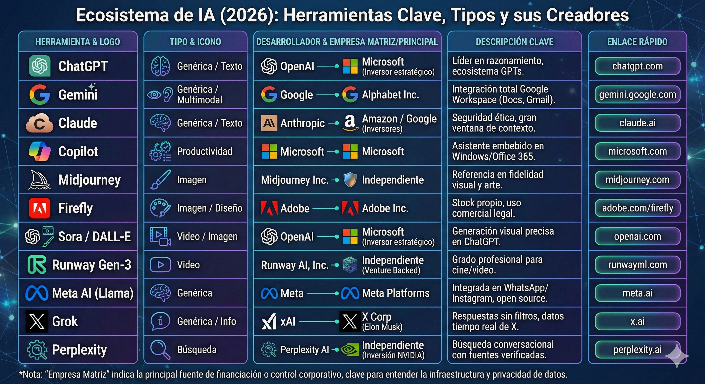

# Introducción a la Inteligencia Artificial en Ofimática

## ¿Qué es la Inteligencia Artificial (IA)?

La Inteligencia Artificial (IA) es una rama de la informática que busca crear sistemas capaces de realizar tareas que normalmente requieren inteligencia humana, como el aprendizaje, el razonamiento, la resolución de problemas, la percepción y el procesamiento del lenguaje natural. En el contexto moderno, la IA generativa —como los modelos de lenguaje grandes (LLM) como ChatGPT, Gemini o Copilot— puede crear contenido nuevo, desde textos hasta imágenes, basándose en patrones aprendidos de grandes cantidades de datos.

En el ámbito de las aplicaciones ofimáticas, la IA actúa como un **asistente inteligente** que acelera procesos rutinarios, mejora la creatividad y optimiza la productividad. Herramientas como Microsoft Copilot en Office 365, Google Gemini en Workspace o funciones integradas en Canva y Adobe permiten automatizar tareas como la redacción de documentos, el análisis de datos en hojas de cálculo, la generación de presentaciones o la edición de imágenes.

## ¿Por qué integrar la IA en Ofimática hoy?

Vivimos en una era donde la tecnología evoluciona rápidamente, y la IA ya no es un concepto futurista, sino una realidad cotidiana. En el mundo laboral y educativo, las aplicaciones ofimáticas son herramientas esenciales para la comunicación, el análisis y la creación de contenido. Integrar la IA en estas herramientas no solo moderniza el aprendizaje y el trabajo, sino que prepara a los usuarios para un futuro donde la colaboración humano-máquina es la norma.

### Beneficios clave:
- **Eficiencia y ahorro de tiempo:** La IA puede generar borradores, sugerir fórmulas complejas o automatizar correcciones, permitiendo enfocarse en tareas de mayor valor.
- **Accesibilidad:** Facilita el aprendizaje para principiantes, ofreciendo explicaciones paso a paso y ejemplos personalizados.
- **Creatividad potenciada:** Herramientas como generadores de imágenes o asistentes de redacción inspiran nuevas ideas sin reemplazar el pensamiento humano.
- **Análisis avanzado:** En hojas de cálculo y bases de datos, la IA detecta patrones y propone insights que antes requerían expertise avanzado.

### Riesgos y consideraciones éticas:
Aunque la IA ofrece grandes ventajas, su uso indiscriminado puede llevar a errores, como "alucinaciones" (información falsa generada), sesgos en los datos o dependencia excesiva. En ofimática, es crucial validar siempre la salida de la IA, mantener la autoría del trabajo y respetar derechos de autor. El enfoque de este módulo es enseñar a usar la IA como **herramienta de apoyo**, no como sustituto del aprendizaje y la crítica humana.

En este curso, aplicaremos la "Regla de las 3 C" (Contexto, Crítica, Comprobación) para un uso responsable, asegurando que los estudiantes no solo utilicen la IA, sino que la entiendan y la controlen.

---

## 🤖 Integración de la IA Generativa en Aplicaciones Ofimáticas

El objetivo es enseñar a los alumnos a utilizar la IA como un **asistente de productividad**, pero a la vez, como una *herramienta de validación**.

### 1. 🖼️ UD 6: Manipulación de Imágenes (15 h)

| Aplicación de la IA | Enfoque y Advertencia |
| :--- | :--- |
| **Generación de Imágenes de Relleno** | Usar herramientas como **Copilot (Bing Image Creator)** o **DALL-E** (integrado en Canva/Office) para crear **imágenes de *stock* o fondos personalizados**. |
| **Relleno Generativo y Eliminación de Objetos** | Uso de funciones tipo **Magic Eraser** (Google Fotos/Canva) o **Relleno Generativo** (Photoshop) para retoques rápidos. |
| **Advertencia Fundamental (UD6)** | La IA genera imágenes, pero el usuario debe entender conceptos básicos de **resolución**, **derechos de autor** y **proporciones** para dar el *prompt* correcto y validar la salida. **El ojo humano debe revisar la anatomía, el texto y los detalles.** |

### 2. 📝 UD 2: Procesadores de Texto (60 h) y 💻 UD 8: Presentaciones (15 h)

Aquí se pueden usar herramientas como **Microsoft Copilot** (si hay acceso a la suite 365) o **Google Gemini / ChatGPT**.

| Aplicación de la IA | Enfoque y Advertencia |
| :--- | :--- |
| **Generación de Borradores y Estructuras** | Usar la IA para generar el **índice** o un **primer borrador** de un informe, carta o presentación. |
| **Corrección de Estilo y Tono** | Pedir a la IA que **reformule párrafos** para ser más profesional, más conciso o cambiar el tono de formal a informal. |
| **Creación de Fórmulas en Documentos** | En Word o Google Docs, la IA puede **redactar fórmulas complejas** para campos automáticos, listas numeradas personalizadas o tablas. |
| **Advertencia Fundamental (UD2/UD8)** | Si la IA redacta el borrador, el usuario debe **validar la información** (verificar datos, citas y contexto). **Riesgo de *alucinaciones***. El *mantenimiento* es imposible si el alumno no entiende *por qué* la IA eligió esa estructura o fórmula. |

### 3. 📊 UD 4: Hojas de Cálculo (49 h)

Esta es una de las unidades con mayor potencial para la IA.

| Aplicación de la IA | Enfoque y Advertencia |
| :--- | :--- |
| **Generación de Fórmulas Complejas** | Pedir a la IA (ej. Gemini/ChatGPT) que **escriba una fórmula compleja** (ej. una fórmula `BUSCARV` anidada con `SI.ERROR` o un `SUMAR.SI.CONJUNTO`) explicando lo que se quiere conseguir. |
| **Análisis de Datos Asistido** | Uso de la función **"Analizar datos"** de Excel o las **"Sugerencias"** de Google Sheets. Preguntar a la herramienta qué gráficos o patrones recomienda para un conjunto de datos. |
| **Normalización y Limpieza de Datos** | Pedir a la IA que proponga o genere fórmulas para **limpiar** nombres, fechas o textos incoherentes en grandes conjuntos de datos. |
| **Advertencia Fundamental (UD4)** | **El alumno debe desglosar la fórmula generada por la IA.** Si solo la copia y pega, no podrá **depurar errores** (ej. referencias a celdas incorrectas, errores de sintaxis) ni adaptarla a un nuevo conjunto de datos. **El conocimiento del anidamiento de funciones es irremplazable para el mantenimiento.** |

### 4. 🧠 Enfoque Transversal: "La Regla de las 3 C"

Puedes introducir esta regla al inicio y recordarla en cada unidad:

1.  **Contexto:** Siempre darle a la IA el contexto completo (el objetivo del documento, el público, el formato, los datos de origen). **Sin contexto, la salida es genérica e inútil.**
2.  **Crítica:** El usuario es el editor y el validador final. **Nunca asumir que la salida es 100% correcta.**
3.  **Comprobación (Mantenimiento):** Si la IA genera código, fórmulas o estructuras, el usuario debe saber **leerlo** y **mantenerlo/depurarlo**. Un trabajo generado por IA que el usuario no entiende es un **pasivo** (una deuda técnica) a futuro.

IA por proveedores Enero 2026

###  ENLACES

[IA por uso](https://www.linkedin.com/posts/briascoi_deja-de-usar-la-ia-equivocada-para-el-trabajo-activity-7421501927391236097-zsHv?utm_source=share&utm_medium=member_desktop&rcm=ACoAAAKxBMYBuh46NL0tOjl0ExLVpV7I9hMJjUw)

