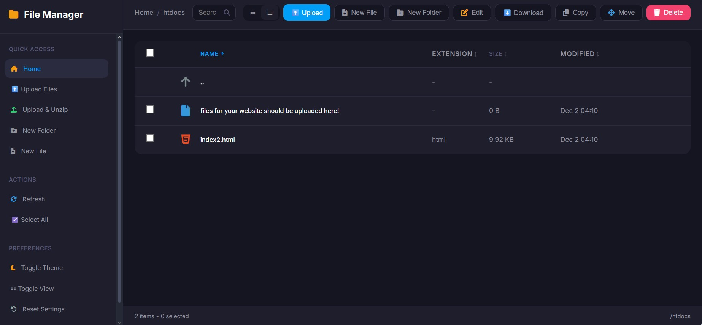

## 🚀 ¡Misión Práctica! Publicando tu Web Estática

**¡Hoy convertiremos tu código HTML local en una página web real en Internet!**

Hemos visto la teoría de los Servidores Web y el protocolo **FTP**. Ahora vamos a usar el **Gestor de Archivos** de nuestro hosting gratuito (`InfinityFree`) para subir vuestra página HTML. Esto es lo que hace un cliente FTP, ¡pero sin instalar nada extra!

### 🎯 Nuestro Objetivo

Que tu página web de HTML y CSS que creasteis se vea en la dirección que nos dio InfinityFree (por ejemplo, `http://tu-proyecto.freevar.com`).

---

### FASE 1: La Preparación (5 min)

#### 1. Revisa tu Material
* **Asegúrate:** Todos los archivos de tu página HTML deben estar listos (el `index.html`, tus carpetas de `css`, `img`, `js`, etc.).
* **Tu Carpeta Única:** Si tienes muchos archivos, **comprime toda la carpeta de tu web en un archivo ZIP** (Ej: `mi-web.zip`). Esto hará la subida mucho más rápida.

#### 2. Acceso al Servidor
* Abre tu panel de control de InfinityFree.
* Localiza y haz clic en la opción **"File Manager"** o **"Gestor de Archivos"**.

---

### FASE 2: Subiendo tu Web 

#### 1. Encuentra el Hogar de tu Web

Al igual que en tu PC, los servidores tienen carpetas. Solo una es pública.

* Dentro del Gestor de Archivos, busca la carpeta que se llama **`htdocs`**.
* **¡Atención!** Esta es la carpeta **más importante**. Todo lo que pongas aquí dentro será visible en Internet.

#### 2. Sube y Descomprime

1.  Usa el botón de **"Upload"** o **"Subir archivo"** (suele estar arriba).
2.  Sube el archivo **`.zip`** que creaste con toda tu web.
3.  Una vez subido, haz clic derecho sobre el archivo `.zip` y elige la opción **"Extract"** o **"Descomprimir"**.

#### 3. ¡El Archivo Mágico!

Tu servidor necesita saber qué archivo mostrar primero. El nombre estándar es `index.html`.

* **Verifica:** Asegúrate de que tu archivo **`index.html`** esté **directamente** dentro de la carpeta **`htdocs`**.
    * *❌ Mal:* `htdocs/mi_web/index.html`
    * *✅ Bien:* `htdocs/index.html` (y tus carpetas `css`, `img` al mismo nivel).
* Si tu archivo `index.html` quedó dentro de una subcarpeta al descomprimir, **muévelo** directamente a `htdocs`.

---

### FASE 3: ¡Misión Cumplida! (5 min)

#### 1. Comprobación Final
* Abre una nueva pestaña en tu navegador.
* Escribe la dirección de tu web asignada por InfinityFree (la URL de tu dominio).
* **Si todo está bien,** ¡tu web se cargará!

#### 2. ¿Algo falló? (Debugging)
* **Error 404 / "Index of":** El `index.html` no está en `htdocs` o tiene un nombre incorrecto (debe ser *exactamente* `index.html`).
* **Imágenes o CSS no se ven:** Las rutas en tu HTML están mal. Vuelve a revisar que las carpetas `img` o `css` estén en `htdocs` y que los enlaces internos (``) sean correctos.

---

### 💡 Próximo Paso: El Salto a WordPress

Acabas de hacer todo manualmente. ¿Te imaginas tener que hacer esto cada vez que publicas una entrada de blog o añades una foto? ¡Sería una locura!

En la próxima sesión, usaremos el instalador automático de WordPress. Este programa hará toda la subida de archivos (¡miles de ellos!) y la configuración de la base de datos **por ti**. Lo importante es que ahora ya sabes **dónde** se van a guardar todos esos archivos: **¡en la carpeta `htdocs` de tu servidor!**

# webgrafía

[Despliege LAMP](https://docs.google.com/presentation/d/1Q1mgc70qOLfDEzAQCqPw9Rml3mcM703J4GfvI4elvvs/edit?slide=id.g2ea1ec72ed7_0_0#slide=id.g2ea1ec72ed7_0_0
)

