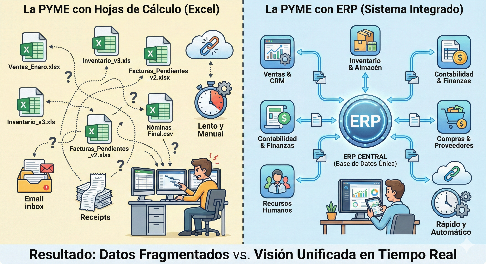

### 🏦 ¿Qué es un ERP?

Si las herramientas colaborativas que vimos antes son para que las personas se comuniquen, un **ERP** es para que los **datos** de la empresa se comuniquen. Su objetivo es que toda la operativa (ventas, stock, nóminas, contabilidad) ocurra en un solo lugar, evitando que la información esté fragmentada en archivos de Excel sueltos.

---

## 🏆 Los 5 ERP Estándar Líderes en 2026

Podemos clasificar los ERP según el tamaño de la empresa y su complejidad:

| ERP | Perfil de Empresa | Punto Fuerte |
| --- | --- | --- |
| **SAP (S/4HANA / Business One)** | Grandes corporaciones y PYMES potentes. | El estándar mundial. Ultra robusto y fiable para procesos complejos. |
| **Microsoft Dynamics 365** | Empresas que ya usan Office 365 / Azure. | Integración total con Excel, Outlook y Copilot (IA). Muy flexible. |
| **Oracle NetSuite** | Empresas nativas digitales y globales. | 100% en la nube desde su origen. Excelente para gestionar varias sedes. |
| **Odoo** | Startups y PYMES que buscan agilidad. | **Código abierto** y modular. Puedes empezar gratis y añadir módulos. |
| **Sage (200 / X3)** | PYMES industriales y de servicios. | Muy fuerte en gestión contable, fiscal y normativa local (España/Europa). |

---

## ⚙️ ¿Qué gestionan exactamente? (Módulos principales)

Un ERP no es un programa único, sino un conjunto de "piezas" o módulos que se conectan entre sí:

1. **Finanzas y Contabilidad:** Automatiza el libro diario, facturación, impuestos y tesorería.
2. **Recursos Humanos (RRHH):** Gestión de nóminas, vacaciones, contratos y talento.
3. **Cadena de Suministro (SCM):** Compras a proveedores, control de almacén (stock) y logística.
4. **Ventas y CRM:** Gestión de pedidos de clientes y seguimiento comercial.
5. **Producción:** Control de materias primas y tiempos de fabricación (vital para fábricas).

---

## 🌟 Tendencias Clave en 2026 para tu curso

Los ERP modernos ya no son "pantallas grises aburridas":

* **IA Generativa:** Ahora los ERP te permiten preguntar: *"¿Qué producto se venderá más el mes que viene?"* y el sistema genera la respuesta analizando los datos históricos.
* **ERP en la Nube (SaaS):** Ya no se instalan en servidores físicos en la oficina; se accede desde el navegador o el móvil, igual que WordPress.
* **Low-Code:** Muchas de estas herramientas (como Odoo o Microsoft) permiten que personas sin saber mucha programación puedan crear pequeñas aplicaciones o flujos de trabajo personalizados.

---

### 💡 Ejemplo Práctico para clase:

> "Imagina que vendes una camiseta en tu tienda **WordPress**. Al instante, el **ERP** descuenta una unidad del almacén, genera la factura contable automáticamente y le avisa al proveedor si queda poco stock para que nos envíe más."

