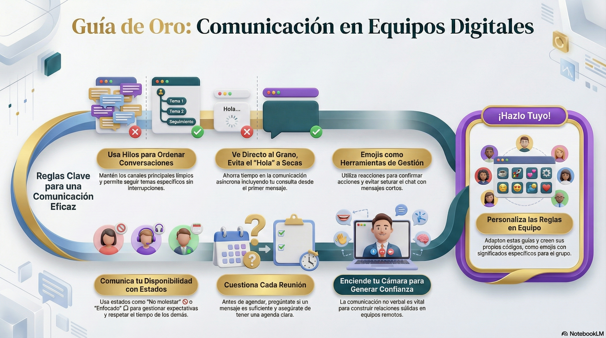

# 📜 Guía de Oro: Comunicación en Equipos Digitales

### 1. La Regla del Hilo (Threads)

* **Mal:** Responder a un tema de ayer en el chat general, mezclándolo con la conversación de hoy.
* **Bien:** Usa la función "Responder en hilo". Esto mantiene el canal limpio y permite que otros sigan la conversación original sin ruido.

### 2. Adiós al "Hola" a secas

* **No hagas esto:** "Hola" (y esperar a que la otra persona responda para escribir tu duda).
* **Haz esto:** "Hola [Nombre], tengo una duda sobre el presupuesto, ¿podemos revisarlo?"
* *Por qué:* En el trabajo asíncrono, ahorras tiempo y vas directo al punto.

### 3. El Poder de los Emojis (Reacciones)

Usa los emojis como herramientas de gestión, no solo como adornos:

* ✅ = Entendido / Hecho.
* 👀 = Lo estoy revisando.
* ➕ = Estoy de acuerdo.
* *Beneficio:* Evitas llenar el canal con mensajes de "Ok", "Vale", "Yo también".

### 4. Notificaciones y Estados

* **Sé transparente:** Si vas a estar concentrado en una tarea, cambia tu estado a 🚫 "No molestar" o 🎧 "Enfocado".
* **Respeta el descanso:** No esperes respuestas inmediatas fuera del horario laboral. Configura tus notificaciones para que no te molesten en tu tiempo libre.

### 5. Reuniones: Menos es Más

Antes de agendar una reunión de Zoom o Meet, hazte estas preguntas:

1. ¿Se puede resolver con un mensaje en Slack?
2. ¿Hay una agenda clara de puntos a tratar?
3. ¿Dura más de 30 minutos? (Intenta que sean de 15 o 20).

* **Al terminar:** Siempre debe haber un responsable de escribir el resumen y los pasos a seguir en el canal correspondiente.

### 6. Video vs. Audio

* En reuniones de equipo, **enciende la cámara** si es posible. La comunicación no verbal (gestos, sonrisas) ayuda a construir la confianza que se pierde tras la pantalla.

---

### 💡 Sugerencia para el ejercicio práctico:

Pide a cada grupo que elija **3 de estas reglas** y las personalice para su equipo. Por ejemplo: *"En nuestro grupo, el emoji de ☕ significa que me he ido a descansar 10 minutos"*.

Esto les da sentido de pertenencia y control sobre sus herramientas.

