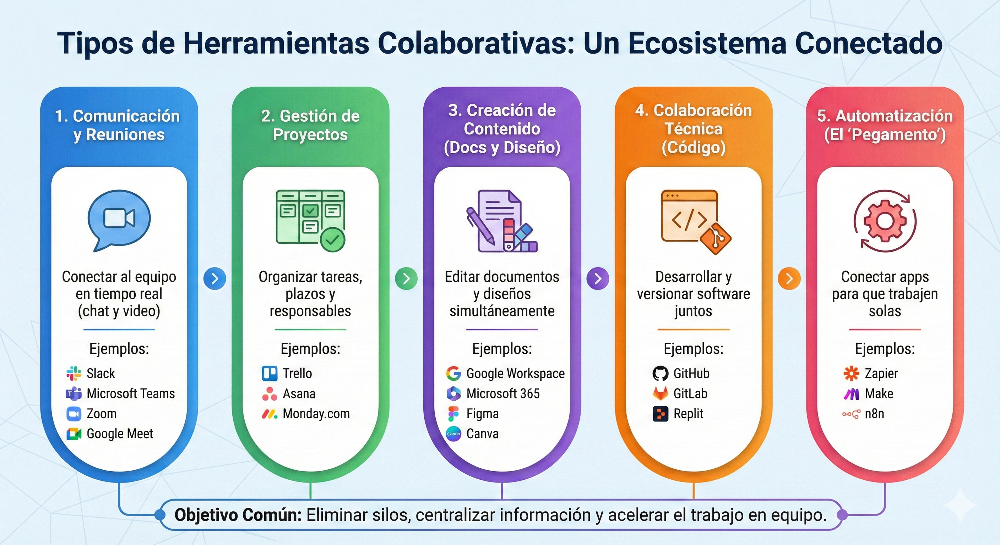

## 🚀 Introducción: Del "Yo" al "Nosotros" Digital

Hasta ahora, hemos  aprendido a crear contenido: un documento, una tabla o una página web. Pero, ¿qué pasa si cinco personas necesitan editar esa web al mismo tiempo? ¿O si el diseñador tiene que pasarte el código de un botón que tú debes insertar en HTML?

Las herramientas colaborativas no son solo programas; son **espacios de trabajo compartidos**. Su objetivo es eliminar tres grandes problemas:

1. **Las versiones infinitas:** (ej. *archivo_final_v2_este_si.docx*).
2. **El caos de correos:** Perder información importante en hilos interminables.
3. **La distancia:** No importa dónde estés, el equipo está a un clic.

---

## 🛠️ Esquema de Herramientas Colaborativas (por Uso)

Para no perdernos, vamos a clasificar las herramientas según **para qué se usan**. Este es el mapa actual del mercado:

### 1. Comunicación y Reuniones (El "Cuartel General")

Son las herramientas para hablar, ya sea por texto (asíncrono) o por video (síncrono).

* **Slack / Microsoft Teams:** Son como un "WhatsApp para el trabajo" organizado por canales temáticos.
* **Discord:** Muy usado en equipos de desarrollo por su fluidez en voz y texto.
* **Zoom / Google Meet:** Para verse las caras y compartir pantalla mientras explican un código o un diseño.

### 2. Documentación y Ofimática en la Nube (El "Escritorio Vivo")

Aquí es donde viven los archivos que ya conocen, pero con superpoderes: ¡varios usuarios escriben a la vez!

* **Google Workspace (Docs, Sheets):** El estándar de simplicidad.
* **Microsoft 365:** La versión potente de Word y Excel conectada a la nube.
* **Notion:** Una "navaja suiza" que mezcla documentos, bases de datos y notas. Es ideal para documentar cómo funciona una web de WordPress.

### 3. Gestión de Proyectos y Tareas (El "Tablero de Control")

Sirven para saber **quién hace qué y para cuándo**.

* **Trello:** Muy visual, basado en tarjetas que se mueven (ideal para principiantes).
* **Asana / Monday.com:** Para proyectos más complejos con fechas límite y flujos de trabajo.
* **Todoist:** Perfecto para listas de tareas sencillas y personales/grupales.

### 4. Diseño y Prototipado (La "Pizarra Visual")

Antes de tocar el HTML o WordPress, los equipos "dibujan" la web aquí.

* **Figma:** La herramienta líder. Permite que un diseñador y un programador vean las medidas exactas de un elemento para llevarlo al código.
* **Canva:** Para crear contenido visual rápido de forma cooperativa.
* **Miro / Mural:** Pizarras blancas infinitas para hacer lluvias de ideas (brainstorming).

### 5. Colaboración Técnica (Para vuestro HTML/Web)

Como ya saben algo de código, estas herramientas les permiten trabajar en el mismo archivo sin borrar lo que hizo el compañero.

* **GitHub:** Es el "Facebook de los programadores". Guarda copias de seguridad de vuestro código y permite fusionar el trabajo de varios.
* **Replit / CodePen:** Editores de código en línea donde pueden programar HTML/CSS en pareja en tiempo real.

### 6. Automatizaciones (El "Pegamento" Digital)

Estas herramientas sirven para conectar aplicaciones. Por ejemplo: "Si alguien rellena un formulario en mi **WordPress**, crea automáticamente una tarjeta en **Trello** y avísame por **Slack**".

* **Zapier:** La más sencilla e intuitiva. Perfecta para entender la lógica de "Disparador y Acción". [https://zapier.com](https://zapier.com)
* **n8n:** Muy potente y flexible. Al ser de código abierto y permitir nodos de JavaScript, les encantará si quieren aplicar lo que saben de programación. [https://n8n.io](https://n8n.io)
* **Make (antes Integromat):** Muy visual, permite crear flujos complejos de forma gráfica. [https://www.make.com](https://www.make.com)

 **Nota para 2026:** Casi todas estas herramientas ya incluyen **Asistentes de IA** (como Copilot o Gemini) que les ayudarán a resumir reuniones, escribir borradores de correos o incluso corregir errores en su HTML automáticamente.

