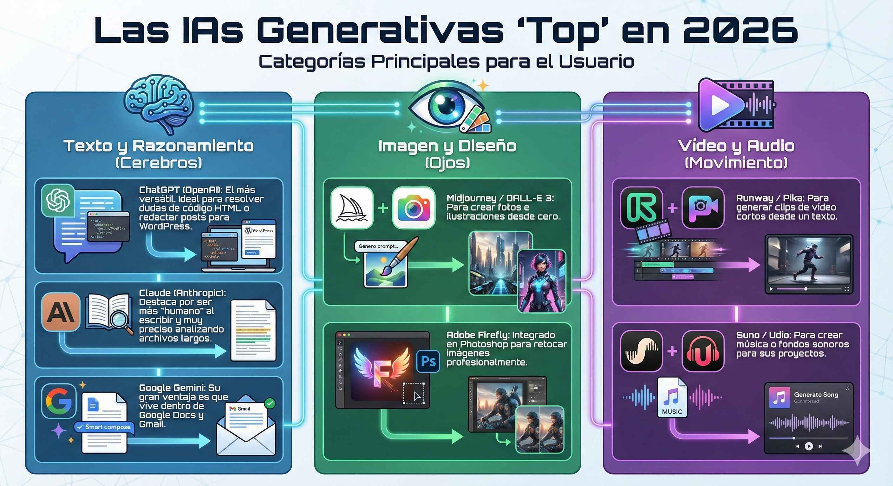

## 🤖 Módulo: Inteligencia Artificial para el Día a Día

### 1. Las IAs Generativas "Top" en 2026

No todas las IAs sirven para lo mismo. Para empezar, deben conocer las tres categorías principales:

* **Texto y Razonamiento (Cerebros):** * **ChatGPT (OpenAI):** El más versátil. Ideal para resolver dudas de código HTML o redactar posts para WordPress.
* **Claude (Anthropic):** Destaca por ser más "humano" al escribir y muy preciso analizando archivos largos.
* **Google Gemini:** Su gran ventaja es que vive dentro de Google Docs y Gmail.

* **Imagen y Diseño (Ojos):**
* **Midjourney / DALL-E 3:** Para crear fotos e ilustraciones desde cero.
* **Adobe Firefly:** Integrado en Photoshop para retocar imágenes profesionalmente.

* **Vídeo y Audio (Movimiento):**
* **Runway / Pika:** Para generar clips de vídeo cortos desde un texto.
* **Suno / Udio:** Para crear música o fondos sonoros para sus proyectos.

---

### 2. El Arte del Prompting (Saber pedir)

Un **Prompt** es simplemente la instrucción que le damos a la IA. Para que un principiante obtenga resultados excelentes, enséñales esta "fórmula magistral":

> **Fórmula del Prompt Perfecto:**
> **[Rol]** + **[Contexto]** + **[Tarea]** + **[Formato/Restricción]**

* **Ejemplo malo:** "Escríbeme un post sobre HTML".
* **Ejemplo PRO:** "Actúa como un **profesor de tecnología** (Rol). Mis alumnos están empezando y no saben mucho (Contexto). Escribe una **explicación de 3 párrafos** sobre qué es una etiqueta `
` (Tarea). Usa un **tono divertido y pon un ejemplo simple** (Restricción)".

---

### 3. NotebookLM: Tu Cerebro de Estudio Personalizado

Esta es la herramienta más potente de Google para aprender. A diferencia de ChatGPT, que sabe "de todo un poco", **NotebookLM solo sabe lo que tú le digas**.

* **¿Cómo funciona?** Creas un "cuaderno" y subes tus propios archivos (PDFs de clase, tus códigos HTML, el manual de WordPress o incluso links de YouTube).
* **¿Qué puedes hacer?**
* **Preguntar sobre tus notas:** "Según mis apuntes, ¿cuáles eran los errores comunes en WordPress?".
* **Resumen de Audio (Podcast):** Con un clic, la IA crea una conversación entre dos locutores que explican tus apuntes. ¡Ideal para repasar mientras vas en el bus!
* **Guías de estudio:** Genera automáticamente **Flashcards** (tarjetas de memoria) y **Quizzes** (exámenes) para ver si has aprendido el tema.

> **Uso práctico para el curso:**  Subir  todos los esquemas que les has dado hasta ahora a NotebookLM. Así tendrán un tutor privado que conoce exactamente lo que tú les has enseñado.

---

[Dominar NotebookLM en 2026](https://www.youtube.com/watch?v=b2fGNHPlUGA)

Añade este enlace a un cuaderno de NOTEBOOKLM e investiga sobre el mismo. El video esta en ingles pero vas a poder trabarlo como si estiviera en español.
