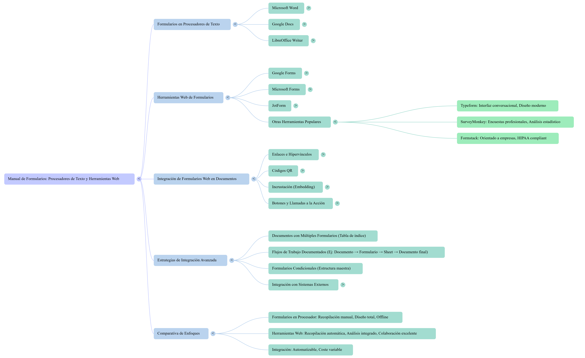

Informe Comparativo: Plataformas de Creación de Formularios en Línea para Decisiones Empresariales

1.0 Introducción: La Importancia Estratégica de la Recopilación de Datos

1.1 Contexto y Propósito del Informe

La agilidad para recopilar, gestionar y analizar datos define la ventaja competitiva en el entorno empresarial actual. Los formularios en línea han evolucionado de ser simples herramientas de contacto a convertirse en potentes puntos de entrada de información para una multitud de procesos: desde la generación de prospectos y la investigación de mercado hasta la aceptación de pagos y la gestión de flujos de trabajo internos. La elección de la plataforma adecuada puede impactar directamente en la calidad de los datos obtenidos, la experiencia del usuario y la eficiencia operativa. El propósito de este informe es proporcionar un análisis comparativo y objetivo de seis plataformas líderes —Jotform, Google Forms, Microsoft Forms, Typeform, SurveyMonkey y Formstack— para ayudar a los profesionales a seleccionar la herramienta que mejor se alinee con sus objetivos de negocio.

1.2 Metodología de Evaluación

Para garantizar un análisis relevante y práctico, nuestra evaluación se articula en torno a cinco pilares estratégicos que reflejan las necesidades empresariales más comunes. A lo largo de este informe, se examinarán las siguientes dimensiones:

* Capacidades de Personalización: La facilidad de uso de la interfaz y la variedad de tipos de preguntas disponibles.
* Funcionalidades Avanzadas: La disponibilidad de herramientas como lógica condicional, procesamiento de pagos y firmas electrónicas que habilitan procesos complejos.
* Ecosistema de Integraciones: La capacidad de la plataforma para conectarse con otro software empresarial (CRM, almacenamiento, marketing) y automatizar flujos de trabajo.
* Análisis de Datos: Las herramientas nativas para la visualización y exportación de datos que facilitan la obtención de información valiosa.
* Adecuación a Casos de Uso Específicos: La idoneidad de cada herramienta para diferentes escenarios, desde encuestas sencillas hasta procesos empresariales regulados.

Este análisis comenzará por evaluar las características fundamentales que constituyen la base de cualquier herramienta de creación de formularios.

2.0 Análisis Comparativo de Características Fundamentales

2.1 Introducción a las Capacidades Esenciales

Las características fundamentales de un creador de formularios —desde la fluidez de su interfaz de usuario hasta la diversidad de los tipos de campos que ofrece— son el pilar sobre el que se construye tanto una recopilación de datos efectiva como una experiencia de usuario positiva. Una interfaz intuitiva reduce la curva de aprendizaje para los creadores, mientras que una amplia gama de opciones de preguntas permite capturar la información precisa de la manera más adecuada. Esta sección analizará cómo cada una de las plataformas evaluadas aborda estos elementos básicos.

2.2 Interfaz y Facilidad de Uso

La experiencia de creación de formularios varía significativamente entre las plataformas, cada una con un enfoque distintivo:

* Jotform destaca por su constructor visual drag-and-drop (arrastrar y soltar), que ofrece un alto grado de control y flexibilidad. Su acceso a más de 10,000 plantillas predefinidas acelera considerablemente el proceso de creación, lo que lo hace ideal para empresas que necesitan lanzar formularios complejos y personalizados rápidamente sin depender de equipos de desarrollo.
* Google Forms y Microsoft Forms se benefician de su integración nativa en sus respectivos ecosistemas (Google Workspace y Microsoft 365). Sus interfaces son limpias, sencillas y familiares, convirtiéndolas en la opción más eficiente para tareas internas rápidas donde la familiaridad y la velocidad son más importantes que la personalización avanzada.
* Typeform se diferencia por su interfaz conversacional de "una pregunta por pantalla". Este enfoque está diseñado para maximizar la participación del encuestado, creando una experiencia más atractiva y menos intimidante, una ventaja decisiva en campañas de marketing donde maximizar la tasa de finalización es un objetivo clave.

2.3 Tipos de Preguntas y Opciones de Personalización

La capacidad de hacer la pregunta correcta de la manera correcta es crucial. A continuación, se compara la variedad de campos disponibles en cada herramienta:

* Google Forms: Ofrece un conjunto sólido de tipos de preguntas estándar, incluyendo respuesta corta, párrafo, opción múltiple, casillas de verificación, lista desplegable, escala lineal y cuadrículas de opción múltiple.
* Microsoft Forms: Proporciona opciones similares como elección, texto, clasificación, fecha, además de campos especializados como la escala Likert y la pregunta de Net Promoter Score (NPS), muy útil para medir la lealtad del cliente.
* Jotform: Presenta la gama más extensa de opciones. Además de los campos estándar, incluye campos avanzados como carga de archivos, geolocalización, y un calendario de citas. Su verdadero poder reside en sus más de 300 widgets, que añaden funcionalidades especializadas como la captura de firmas y cálculos automáticos.
* Typeform, SurveyMonkey y Formstack: Typeform se centra en campos interactivos que mejoran la experiencia conversacional; SurveyMonkey se especializa en tipos de preguntas diseñados para un análisis estadístico riguroso; y Formstack ofrece campos adaptados a flujos de trabajo empresariales y la captura de datos regulados.

2.4 Conclusión y Transición de la Sección

Si bien las características básicas son el punto de partida esencial para cualquier tarea de recopilación de datos, el verdadero poder para los negocios reside en las funcionalidades que van más allá de lo estándar. Son las capacidades avanzadas las que transforman un simple formulario en una herramienta estratégica de automatización y eficiencia.

3.0 Evaluación de Funcionalidades Avanzadas y Casos de Uso Empresarial

3.1 Introducción al Valor de las Funciones Avanzadas

Las funcionalidades avanzadas como la lógica condicional, el procesamiento de pagos y las firmas electrónicas son las que verdaderamente transforman un simple formulario en línea en una potente herramienta de automatización de procesos de negocio. Estas capacidades permiten crear experiencias dinámicas y personalizadas para los usuarios, a la vez que habilitan transacciones comerciales y acuerdos contractuales directamente desde el formulario, eliminando pasos manuales y optimizando flujos de trabajo críticos.

3.2 Lógica Condicional y Ramificación

La lógica condicional permite mostrar u ocultar preguntas o secciones enteras de un formulario basándose en las respuestas previas del usuario, creando una ruta personalizada y relevante para cada individuo.

* Google Forms implementa esto a través de la opción de ir a una sección específica basada en una respuesta, lo cual es efectivo para formularios segmentados.
* Microsoft Forms utiliza un sistema similar denominado "ramificación condicional", que permite dirigir a los usuarios a diferentes preguntas según sus elecciones.
* Typeform es conocido por su "lógica avanzada", que se integra fluidamente en su formato conversacional para crear encuestas dinámicas y atractivas.

Independientemente de la implementación, el resultado es una mejor experiencia para el usuario, menores tasas de abandono y una mayor calidad de los datos al evitar preguntas irrelevantes.

3.3 Procesamiento de Pagos y Firmas Electrónicas

La capacidad de gestionar transacciones y acuerdos legales es una diferenciación clave para los casos de uso empresarial.

* Jotform se destaca en esta área, ofreciendo una amplia gama de integraciones de pago nativas con procesadores líderes como PayPal, Stripe, Square, Apple Pay y Google Pay. Esto permite crear formularios de pedido, registro de eventos con cobro o portales de donación de manera segura y eficiente. Además, su funcionalidad de firma electrónica, Jotform Sign, permite recopilar firmas legalmente vinculantes, automatizando procesos de contratación y acuerdos.
* Esta carencia nativa posiciona a herramientas como Google Forms y Microsoft Forms como soluciones para casos de uso internos y sencillos, mientras que plataformas como Jotform se establecen como herramientas transaccionales capaces de gestionar procesos de negocio de cara al cliente de principio a fin.

3.4 Capacidades Específicas para Empresas y Cumplimiento Normativo

Para organizaciones que manejan datos sensibles o que operan a gran escala, las características empresariales y el cumplimiento de normativas son factores decisivos.

* Formstack y Jotform ofrecen cumplimiento con la normativa HIPAA, un requisito indispensable para cualquier organización del sector de la salud que maneje información protegida de pacientes.
* Jotform también ofrece una solución Jotform Enterprise, diseñada para grandes equipos que necesitan un entorno dedicado, soporte prioritario y herramientas avanzadas de colaboración y administración.

3.5 Conclusión y Transición de la Sección

Disponer de funcionalidades avanzadas es fundamental, pero su verdadero potencial se desbloquea cuando los datos recopilados pueden fluir sin fricciones hacia otros sistemas empresariales. Por lo tanto, las funcionalidades avanzadas deben estar respaldadas por un ecosistema robusto de integraciones para maximizar su valor.

4.0 Ecosistema de Integraciones y Automatización

4.1 Introducción a la Importancia de la Conectividad

Una herramienta de creación de formularios no debe operar como un silo de datos. Su valor estratégico se multiplica cuando actúa como un punto de entrada que se conecta fluidamente con el resto del software empresarial. Las integraciones permiten que los datos recopilados —ya sean leads, pedidos, o respuestas de encuestas— alimenten automáticamente sistemas de CRM, plataformas de email marketing, soluciones de almacenamiento en la nube o herramientas de gestión de proyectos, eliminando la entrada manual de datos y creando flujos de trabajo automatizados y eficientes.

4.2 Profundidad de las Integraciones por Plataforma

El nivel de conectividad varía significativamente entre las plataformas, desde una profunda integración en un ecosistema cerrado hasta una vasta red de conexiones de terceros.

Plataforma	Integraciones Clave	Nivel de Conectividad
Jotform	CRMs (Salesforce, HubSpot), Almacenamiento (Google Drive, Dropbox), Email Marketing (Mailchimp, Active Campaign), y Automatización (Zapier, Make, Microsoft Power Automate).	Extensivo (más de 150 integraciones nativas)
Google Forms	Integración nativa y profunda con Google Sheets y Google Classroom.	Fuerte dentro del ecosistema de Google Workspace, expandible con complementos.
Microsoft Forms	Integración nativa con Excel, Power Automate, Teams y SharePoint.	Fuerte dentro del ecosistema de Microsoft 365.
Typeform, SurveyMonkey, Formstack	Se conectan con herramientas de automatización como Zapier para expandir su alcance a cientos de otras aplicaciones.	

4.3 Conclusión y Transición de la Sección

Una vez que los datos han sido recopilados de manera eficiente e integrados de forma automática en los sistemas empresariales correspondientes, el siguiente paso lógico es analizarlos. La capacidad de transformar los datos brutos en información procesable es lo que finalmente impulsa la toma de decisiones informada.

5.0 Capacidades de Análisis de Datos y Generación de Reportes

5.1 Introducción al Análisis de Datos Recopilados

La recopilación de datos es solo el primer paso en un proceso mucho más amplio. El verdadero valor empresarial no reside en la cantidad de datos acumulados, sino en la capacidad de analizarlos de manera eficiente para identificar tendencias, comprender a los clientes y tomar decisiones estratégicas basadas en evidencia. Las herramientas de análisis y reporte son, por tanto, un componente crítico de su propuesta de valor.

5.2 Herramientas Nativas para Análisis Operativo

Para el análisis operativo y el seguimiento en tiempo real, la mayoría de las plataformas ofrecen capacidades integradas que proporcionan a los gestores una visión instantánea de los resultados:

* Google Forms y Microsoft Forms generan automáticamente gráficos y resúmenes en tiempo real, ideal para obtener una visión general rápida de los resultados.
* Microsoft Forms incluye una característica distintiva de "análisis de sentimientos" para respuestas de texto abierto, que puede ayudar a clasificar rápidamente el feedback cualitativo.
* SurveyMonkey, como plataforma especializada, está enfocada en ofrecer un "análisis estadístico robusto" directamente dentro de la herramienta.
* Jotform cuenta con un "Creador de Reportes" que permite diseñar informes visuales y personalizados, transformando los datos en presentaciones claras y profesionales.

5.3 Exportación para Análisis Estratégico

Para un análisis estratégico profundo, la capacidad de exportar datos es el factor decisivo. Esta funcionalidad actúa como un puente hacia herramientas más potentes, permitiendo a los analistas cruzar datos con otras fuentes de negocio, identificar tendencias a largo plazo y construir modelos predictivos.

* La principal fortaleza de Google Forms es su exportación directa y en tiempo real a Google Sheets, abriendo todo el potencial de una hoja de cálculo para la manipulación avanzada de datos.
* De manera similar, Microsoft Forms se integra perfectamente con Excel, permitiendo a los usuarios realizar análisis complejos utilizando las herramientas con las que ya están familiarizados.

5.4 Conclusión y Transición de la Sección

La elección final de una herramienta de formularios depende de alinear todas las características analizadas —desde la interfaz de usuario y las funcionalidades avanzadas hasta las integraciones y las capacidades de análisis— con los objetivos, el presupuesto y el contexto tecnológico específico de cada negocio. Las siguientes conclusiones ofrecerán recomendaciones claras basadas en estos factores.

6.0 Conclusiones y Recomendaciones Finales

6.1 Síntesis Comparativa

Tras analizar las seis plataformas, emergen perfiles claros que las adecúan a diferentes necesidades empresariales. Google Forms y Microsoft Forms se posicionan como opciones sólidas, gratuitas y altamente efectivas para necesidades internas o recopilación de datos sencillos, especialmente para organizaciones ya inmersas en sus respectivos ecosistemas ofimáticos. Typeform brilla en escenarios donde el engagement y la experiencia del usuario son prioritarios, como en marketing y captación de leads. SurveyMonkey es la herramienta de elección para encuestas profundas y investigación de mercado que requieren un análisis estadístico riguroso. Finalmente, Formstack y Jotform se consolidan como las soluciones más robustas para casos de uso empresariales complejos, que demandan automatización de flujos de trabajo, procesamiento de pagos, firmas electrónicas y, crucialmente, cumplimiento normativo como HIPAA.

6.2 Cuadro de Decisión por Caso de Uso

Para facilitar la selección, la siguiente tabla resume las plataformas recomendadas según la necesidad empresarial o el perfil del usuario:

Necesidad Empresarial / Perfil de Usuario	Plataforma(s) Recomendada(s)
Recopilación rápida de datos y cuestionarios para educación o equipos pequeños (integrados en su suite ofimática).	Google Forms o Microsoft Forms
Marketing, captación de leads y encuestas con alta tasa de respuesta y enfoque en la experiencia de usuario.	Typeform
Encuestas de mercado, investigación académica y análisis estadístico profesional.	SurveyMonkey
Procesos de negocio complejos, flujos de trabajo con aprobaciones, y cumplimiento normativo (ej. HIPAA).	Formstack
Solución todo-en-uno con miles de plantillas, integraciones de pago, firmas electrónicas y una amplia conectividad.	Jotform

6.3 Recomendación Final

Se aconseja a los profesionales que evalúen sus necesidades no solo en el presente, sino también con una visión a futuro. Antes de comprometerse con una plataforma, es fundamental considerar la escalabilidad, la profundidad de las integraciones requeridas y la posible complejidad de los flujos de trabajo que se deseen implementar a mediano y largo plazo. La elección correcta transforma un formulario de una simple utilidad de recolección a un motor central de automatización, convirtiendo los puntos de entrada de datos en el sistema nervioso digital de la organización.

[Investigacion chatgpt](
https://chatgpt.com/s/t_6910d3bc8de88191b2c59ffcb7cbd409)

[Mapa mental formularios (notebooklm -permiso)](https://notebooklm.google.com/notebook/3bfa24d3-e803-4d84-b84e-bc24a3e1edd5)

